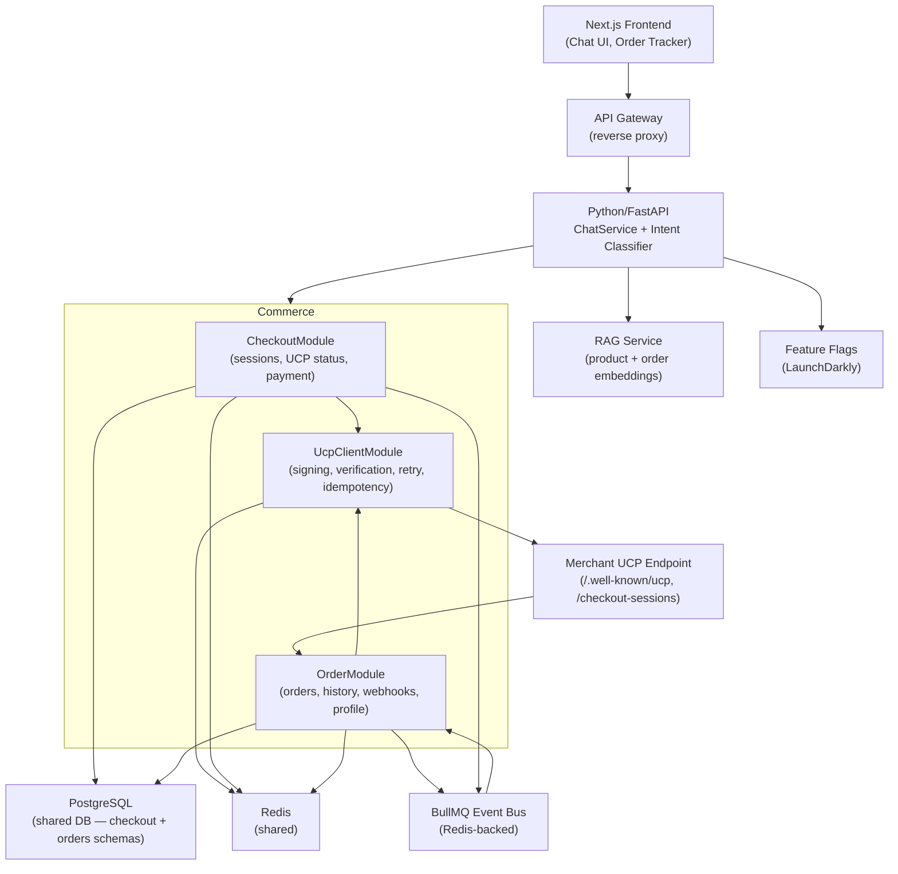
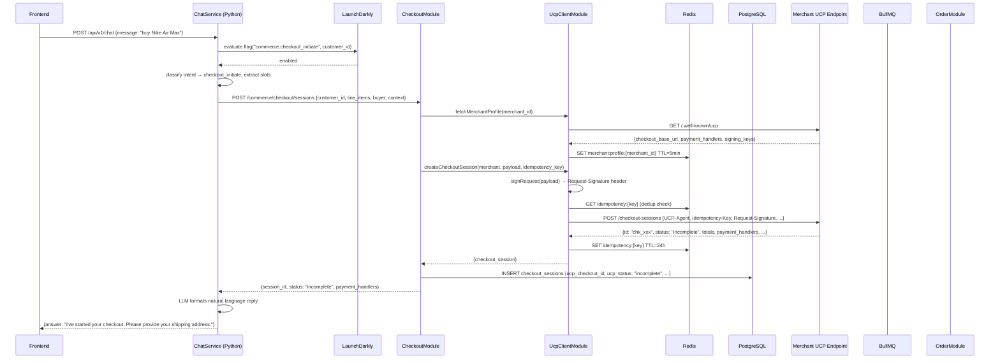
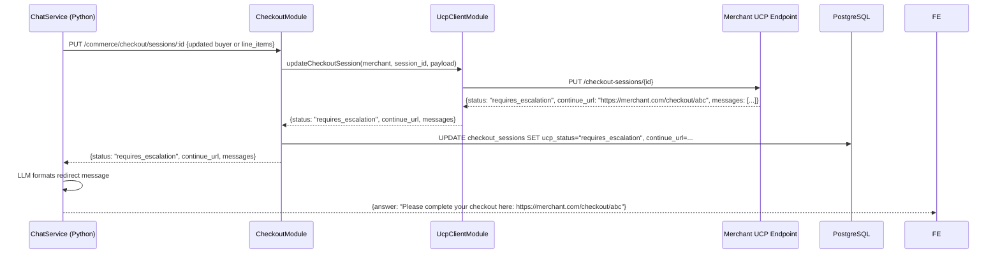
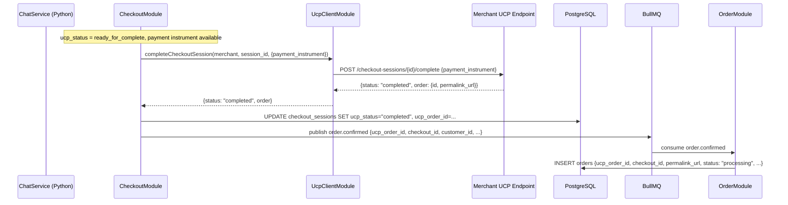
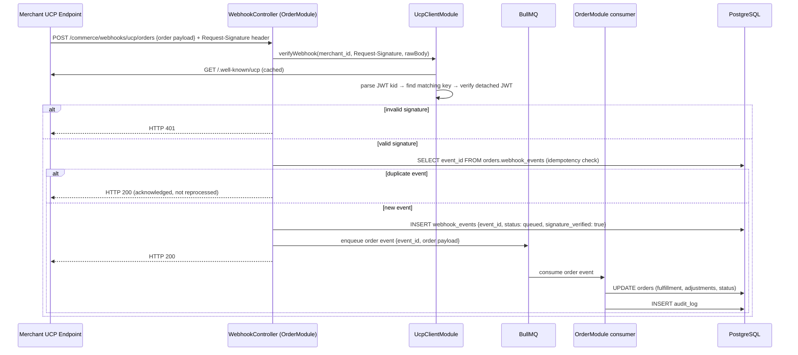

# Design Document: Checkout & Order Service

## Overview

This document describes the technical design for adding checkout and order capabilities to the existing AI-powered conversational commerce platform. The platform currently consists of a Python/FastAPI chat backend, a Next.js frontend, a RAG retrieval service, and a shared PostgreSQL database.

The new commerce layer is a **single NestJS application** at `checkout-order-service/` (at the project root, alongside `backend/`, `Frontend/`, and `rag-service/`). It is structured as a NestJS monolith with three feature modules:

- **CheckoutModule** — checkout session lifecycle, UCP status tracking, payment instrument collection, order confirmation event emission
- **OrderModule** — order creation, history, status tracking, webhook ingestion from merchants, platform profile exposure
- **UcpClientModule** — single chokepoint for all outbound UCP calls; owns merchant profile discovery, request signing, webhook verification, idempotency, retry, and circuit-breaking

All three modules live in the same NestJS process and share the same database connection pool, Redis client, and Event Bus client. They communicate via direct NestJS service injection — no inter-process HTTP calls between them.

The app sits behind the existing Python/FastAPI backend, which continues to own LLM orchestration and intent classification. The LLM never calls UCP or the commerce app directly — all commerce traffic flows through the ChatService → `checkout-order-service/` chain.

### What is UCP?

The **Universal Commerce Protocol (UCP)** is an open standard for agentic commerce (see [ucp.dev](https://ucp.dev)). Our NestJS service acts as a **UCP platform** (analogous to Google Shopping) that calls **merchant-operated** UCP-compliant endpoints. The merchant exposes the protocol; we consume it.

Key protocol facts relevant to this design:

- **Capability discovery**: Every merchant exposes `/.well-known/ucp` — a JSON document listing supported capabilities, the base URL for checkout operations, available payment handlers, and the merchant's public signing keys.
- **Checkout namespace**: `dev.ucp.shopping.checkout` — five REST operations on the merchant's checkout endpoint.
- **Order namespace**: `dev.ucp.shopping.order` — merchant sends lifecycle events as webhooks to a URL we publish in our own UCP profile.
- **REST Binding headers** — required on every outbound request: `UCP-Agent`, `Idempotency-Key` (mutating ops), `Request-Signature` (detached JWT per RFC 7797), `Request-Id`.
- **Amounts** — all monetary values in UCP are **minor units (cents)** as integers. We convert to/from display currency only in API responses.
- **Webhook signatures** — inbound merchant webhooks are signed with a **detached JWT (RFC 7797)** using the merchant's private key. We verify using the merchant's public key from `/.well-known/ucp`.

### Key Design Decisions

1. **Single NestJS app, three feature modules** — `CheckoutModule`, `OrderModule`, and `UcpClientModule` run in one process. They share the same TypeORM connection, Redis client, and Event Bus client. No inter-process HTTP between them.
2. **UcpClientModule as single chokepoint** — all outbound UCP calls go through `UcpClientModule`. No other module holds merchant credentials or calls UCP endpoints directly.
3. **Checkout session = cart** — there is no separate cart entity. When the user adds the first item, we create a UCP checkout session on the merchant side and store a local snapshot. The checkout session IS the cart.
4. **UCP status drives local state** — we do not maintain our own FSM. We store the merchant's `status` field locally and react to it. The merchant owns checkout status.
5. **`requires_escalation` handoff** — when the merchant returns `status = requires_escalation`, we surface the `continue_url` to the ChatService, which tells the user to visit that URL. We do not attempt to complete the checkout ourselves.
6. **`ready_for_complete` auto-complete** — when the merchant returns `status = ready_for_complete` and we have a payment instrument, we call Complete Checkout automatically.
7. **Idempotency Guard** — a 24-hour dedup window in Redis prevents duplicate UCP mutations on retry.
8. **Request signing** — all outbound UCP requests are signed with our platform's private key as a detached JWT (RFC 7797) in the `Request-Signature` header.
9. **Webhook JWT verification** — inbound merchant webhooks carry a `Request-Signature` detached JWT. We verify using the merchant's public key fetched from `/.well-known/ucp`.
10. **Platform profile** — we expose `GET /.well-known/ucp` ourselves so merchants can discover our webhook URL for order events.
11. **Feature flags** — LaunchDarkly SDK in ChatService gates all commerce intents with percentage rollout and instant kill-switch.
12. **RAG extension** — user-scoped order embeddings indexed within 5 minutes of status change, never cross-customer retrievable.
13. **TypeORM migrations in one place** — all migrations live under `checkout-order-service/src/migrations/`, split by schema (`checkout` and `orders`).
14. **Event Bus** — BullMQ (Redis-backed) topics: `order.confirmed`, `order.shipped`, `order.failed`, `payment.failed`.

---

## Architecture

### System Context



### Project Structure

```
checkout-order-service/
  src/
    modules/
      checkout/
        session/          — CheckoutSessionService, CheckoutController, CheckoutSession entity
      orders/
        orders/           — OrderService, OrderController, Order entity
        webhook/          — WebhookController, WebhookService (JWT verify + BullMQ dispatch)
        profile/          — PlatformProfileController (GET /.well-known/ucp)
        audit/            — AuditService (append-only log)
        consumers/        — BullMQ consumers for order events
      ucp-client/
        merchant-profile/ — MerchantProfileService (fetch/cache /.well-known/ucp)
        signing/          — RequestSigningService (detached JWT outbound)
        verification/     — WebhookVerificationService (detached JWT inbound)
        idempotency/      — IdempotencyService (24h Redis dedup)
        retry/            — RetryService (exponential backoff + circuit breaker)
        checkout-client/  — UcpCheckoutClient (5 REST operations)
    migrations/
      checkout/           — 001_create_checkout_schema.ts, 002_checkout_sessions.ts
      orders/             — 001_orders_schema.ts, 002_orders.ts, ...
    shared/
      types/              — UcpCheckoutStatus, UcpOrderStatus, EventEnvelope
      errors/             — CommerceException, error codes
    app.module.ts         — imports CheckoutModule, OrderModule, UcpClientModule
    main.ts               — bootstrap, port 3001
  .env
  package.json
  tsconfig.json
  jest.config.ts
```

### Service Interaction — Checkout Flow



### Service Interaction — requires_escalation Handoff



### Service Interaction — Complete Checkout



### Service Interaction — Webhook Ingestion



---

## Components and Interfaces

### UcpClientModule

Responsibilities: merchant capability discovery, outbound request signing, inbound webhook signature verification, idempotency guard, retry with exponential backoff, circuit breaker. Injected into `CheckoutModule` and `OrderModule` — never called over HTTP.

#### `MerchantProfileService`

Fetches and caches the merchant's `/.well-known/ucp` document. Extracts:
- `checkout_base_url` — base URL for checkout REST operations
- `payment_handlers` — list of supported payment handler identifiers
- `signing_keys` — merchant's public keys (JWK set) for webhook signature verification

Cache key: `merchant:profile:{merchant_id}` in Redis, TTL 5 minutes. Exposes `getProfile()`, `getCheckoutBaseUrl()`, `getPaymentHandlers()`, `getSigningKeys()`.

#### `RequestSigningService`

Signs all outbound UCP requests with our platform's private key using a detached JWT (RFC 7797) via the `jose` library. The JWT payload includes a hash of the request body; the signature is placed in the `Request-Signature` header. Our platform's key pair is loaded from environment / secret store at startup.

Exposes `signRequest(body: Buffer): string` — returns the `Request-Signature` header value.

#### `WebhookVerificationService`

Verifies inbound merchant webhook signatures. Algorithm:
1. Extract `Request-Signature` header (detached JWT)
2. Parse JWT header to get `kid`
3. Call `MerchantProfileService.getSigningKeys(merchantId)` to get the merchant's JWK set
4. Find the key matching `kid`
5. Verify the detached JWT signature against the raw request body

Exposes `verifyWebhook(merchantId: string, signature: string, rawBody: Buffer): Promise<boolean>`.

#### `IdempotencyService`

Stores idempotency key → cached response in Redis with 24-hour TTL. On duplicate key within window, returns cached response without forwarding to the merchant. Returns `idempotency_conflict` (409) when the same key is reused with a different payload.

#### `RetryService` and `CircuitBreakerService`

`RetryService`: exponential backoff with jitter, max 3 retries on transient errors (429, 5xx, timeouts).

`CircuitBreakerService`: opens after 3 consecutive failures on the same merchant endpoint. Half-open probe after 60 seconds. Circuit state persisted in Redis at `circuit:{merchant_id}:{endpoint}`. Returns `ucp_unavailable` (503) when circuit is open.

#### `UcpCheckoutClient`

Wraps all five UCP checkout REST operations. Each method builds required UCP REST Binding headers: `UCP-Agent`, `Idempotency-Key` (mutating ops), `Request-Signature` (via `RequestSigningService`), `Request-Id`.

| Method | UCP Operation | HTTP |
|--------|--------------|------|
| `createCheckoutSession(merchantId, payload, idempotencyKey)` | Create Checkout | `POST /checkout-sessions` |
| `getCheckoutSession(merchantId, sessionId)` | Get Checkout | `GET /checkout-sessions/{id}` |
| `updateCheckoutSession(merchantId, sessionId, payload, idempotencyKey)` | Update Checkout | `PUT /checkout-sessions/{id}` |
| `completeCheckoutSession(merchantId, sessionId, payload, idempotencyKey)` | Complete Checkout | `POST /checkout-sessions/{id}/complete` |
| `cancelCheckoutSession(merchantId, sessionId, idempotencyKey)` | Cancel Checkout | `POST /checkout-sessions/{id}/cancel` |

### CheckoutModule

Responsibilities: create and manage UCP checkout sessions on behalf of the customer, track UCP checkout status locally, handle `requires_escalation` and `ready_for_complete` status transitions, collect payment instrument, publish `order.confirmed` event on completion.

**No separate cart entity** — the checkout session IS the cart. When the user adds the first item, we call `UcpCheckoutClient.createCheckoutSession()` and store the result locally. Subsequent item additions call `updateCheckoutSession()` with the full updated `line_items` array (UCP Update is a full replacement).

**REST API (prefix `/commerce`):**

| Method | Path | Description |
|--------|------|-------------|
| POST | `/commerce/checkout/sessions` | Create checkout session (first item add) |
| GET | `/commerce/checkout/sessions/:id` | Get local session state |
| PUT | `/commerce/checkout/sessions/:id` | Update session (full replacement — line items, buyer, context) |
| POST | `/commerce/checkout/sessions/:id/complete` | Trigger Complete Checkout with payment instrument |
| POST | `/commerce/checkout/sessions/:id/cancel` | Cancel checkout session |
| GET | `/commerce/checkout/sessions/:id/summary` | Totals snapshot in display currency |
| GET | `/commerce/health` | Health check |

### OrderModule

Responsibilities: receive merchant order webhooks, verify JWT signatures, store full UCP order payload locally, expose order history and status queries, expose our platform's UCP profile.

**REST API (prefix `/commerce`):**

| Method | Path | Description |
|--------|------|-------------|
| GET | `/.well-known/ucp` | Platform UCP profile (webhook URL discovery) |
| GET | `/commerce/orders` | Paginated order history (cursor-based) |
| GET | `/commerce/orders/:id` | Order detail + fulfillment events + adjustments |
| POST | `/commerce/orders/:id/cancel` | Cancel order |
| POST | `/commerce/orders/:id/return` | Request return |
| POST | `/commerce/webhooks/ucp/orders` | Ingest merchant order webhook events |


---

## Data Models

### PostgreSQL Schemas

#### `checkout` schema

**`checkout.checkout_sessions`**

```sql
CREATE TABLE checkout.checkout_sessions (
    session_id          UUID PRIMARY KEY DEFAULT uuid_generate_v4(),
    customer_id         UUID NOT NULL REFERENCES public.customers(customer_id),
    merchant_id         VARCHAR(255) NOT NULL,
    ucp_checkout_id     VARCHAR(255),
    ucp_status          VARCHAR(30) NOT NULL DEFAULT 'incomplete',
    -- incomplete | requires_escalation | ready_for_complete | complete_in_progress | completed | canceled
    continue_url        TEXT,
    expires_at          TIMESTAMPTZ,
    line_items_snapshot JSONB NOT NULL DEFAULT '[]',
    -- [{item: {id, title, price}, quantity}]  — price in cents
    buyer_snapshot      JSONB,
    -- {first_name, last_name, email, phone_number}
    context_snapshot    JSONB,
    -- {address_country, address_region, postal_code}
    payment_handlers    JSONB,
    totals_snapshot     JSONB,
    -- {subtotal_cents, tax_cents, grand_total_cents}
    ucp_order_id        VARCHAR(255),
    ucp_order_permalink TEXT,
    created_at          TIMESTAMPTZ NOT NULL DEFAULT NOW(),
    updated_at          TIMESTAMPTZ NOT NULL DEFAULT NOW(),
    created_by          TEXT NOT NULL DEFAULT 'system',
    last_updated_by     TEXT
);

CREATE INDEX idx_checkout_sessions_customer_id ON checkout.checkout_sessions(customer_id);
CREATE INDEX idx_checkout_sessions_ucp_status  ON checkout.checkout_sessions(ucp_status);
CREATE INDEX idx_checkout_sessions_expires_at  ON checkout.checkout_sessions(expires_at)
    WHERE ucp_status NOT IN ('completed', 'canceled');
CREATE UNIQUE INDEX idx_checkout_sessions_ucp_id
    ON checkout.checkout_sessions(ucp_checkout_id)
    WHERE ucp_checkout_id IS NOT NULL;
```

> **Note on amounts**: UCP sends all monetary values as integers in minor units (cents). We store them as cents in JSONB snapshots and convert to display currency only in API responses.

#### `orders` schema

**`orders.orders`**

```sql
CREATE TABLE orders.orders (
    order_id      UUID         PRIMARY KEY DEFAULT uuid_generate_v4(),
    customer_id   UUID         NOT NULL REFERENCES public.customers(customer_id),
    checkout_id   UUID         REFERENCES checkout.checkout_sessions(session_id),
    merchant_id   VARCHAR(255) NOT NULL,
    ucp_order_id  VARCHAR(255) NOT NULL,
    permalink_url TEXT,
    status        VARCHAR(30)  NOT NULL DEFAULT 'processing',
    -- derived: processing | partial | fulfilled | cancelled | return_requested | returned | payment_failed
    line_items    JSONB        NOT NULL DEFAULT '[]',
    fulfillment   JSONB        NOT NULL DEFAULT '{}',
    -- {expectations: [...], events: [...]}  — events is append-only
    adjustments   JSONB        NOT NULL DEFAULT '[]',
    -- append-only: [{type, amount_cents, occurred_at, ...}]
    totals        JSONB        NOT NULL DEFAULT '{}',
    created_at    TIMESTAMPTZ  NOT NULL DEFAULT NOW(),
    updated_at    TIMESTAMPTZ  NOT NULL DEFAULT NOW(),
    created_by    TEXT         NOT NULL DEFAULT 'system',
    last_updated_by TEXT
);

CREATE INDEX idx_orders_customer_id      ON orders.orders(customer_id);
CREATE INDEX idx_orders_status           ON orders.orders(status);
CREATE INDEX idx_orders_created_at       ON orders.orders(created_at DESC);
CREATE INDEX idx_orders_customer_created ON orders.orders(customer_id, created_at DESC);
CREATE UNIQUE INDEX idx_orders_ucp_order_id ON orders.orders(ucp_order_id);
```

**`orders.order_status_history`**

```sql
CREATE TABLE orders.order_status_history (
    history_id  UUID        PRIMARY KEY DEFAULT uuid_generate_v4(),
    order_id    UUID        NOT NULL REFERENCES orders.orders(order_id) ON DELETE CASCADE,
    from_status VARCHAR(30),
    to_status   VARCHAR(30) NOT NULL,
    source      VARCHAR(50) NOT NULL,  -- 'webhook' | 'api' | 'system'
    actor       TEXT,
    note        TEXT,
    created_at  TIMESTAMPTZ NOT NULL DEFAULT NOW()
);

CREATE INDEX idx_order_status_history_order_id ON orders.order_status_history(order_id);
```

**`orders.audit_log`**

```sql
CREATE TABLE orders.audit_log (
    audit_id     UUID        PRIMARY KEY DEFAULT uuid_generate_v4(),
    order_id     UUID        REFERENCES orders.orders(order_id),
    actor        TEXT        NOT NULL,
    action_type  VARCHAR(50) NOT NULL,
    -- order_created | status_changed | cancelled | return_initiated | adjustment_applied
    before_state JSONB,
    after_state  JSONB       NOT NULL,
    source       VARCHAR(50) NOT NULL,  -- 'api' | 'webhook'
    ip_address   INET,
    created_at   TIMESTAMPTZ NOT NULL DEFAULT NOW()
    -- NO updated_at — append-only
);

CREATE INDEX idx_audit_log_order_id   ON orders.audit_log(order_id);
CREATE INDEX idx_audit_log_actor      ON orders.audit_log(actor);
CREATE INDEX idx_audit_log_created_at ON orders.audit_log(created_at DESC);
```

**`orders.webhook_events`**

```sql
CREATE TABLE orders.webhook_events (
    event_id           VARCHAR(255) PRIMARY KEY,
    merchant_id        VARCHAR(255) NOT NULL,
    event_type         VARCHAR(100) NOT NULL,
    payload            JSONB        NOT NULL,
    status             VARCHAR(20)  NOT NULL DEFAULT 'queued',
    -- queued | processed | failed | duplicate
    signature_verified BOOLEAN      NOT NULL DEFAULT FALSE,
    processed_at       TIMESTAMPTZ,
    error              TEXT,
    created_at         TIMESTAMPTZ  NOT NULL DEFAULT NOW()
);

CREATE INDEX idx_webhook_events_status     ON orders.webhook_events(status);
CREATE INDEX idx_webhook_events_merchant   ON orders.webhook_events(merchant_id);
CREATE INDEX idx_webhook_events_created_at ON orders.webhook_events(created_at DESC);
```

### TypeORM Entity Definitions (key fields)

**CheckoutSession entity:**

```typescript
@Entity({ schema: 'checkout', name: 'checkout_sessions' })
export class CheckoutSession {
  @PrimaryGeneratedColumn('uuid') sessionId: string;
  @Column({ type: 'uuid' }) customerId: string;
  @Column() merchantId: string;
  @Column({ nullable: true }) ucpCheckoutId: string | null;
  @Column({ default: 'incomplete' }) ucpStatus: UcpCheckoutStatus;
  @Column({ type: 'text', nullable: true }) continueUrl: string | null;
  @Column({ type: 'timestamptz', nullable: true }) expiresAt: Date | null;
  @Column({ type: 'jsonb', default: '[]' }) lineItemsSnapshot: UcpLineItem[];
  @Column({ type: 'jsonb', nullable: true }) buyerSnapshot: UcpBuyer | null;
  @Column({ type: 'jsonb', nullable: true }) contextSnapshot: UcpContext | null;
  @Column({ type: 'jsonb', nullable: true }) paymentHandlers: unknown | null;
  @Column({ type: 'jsonb', nullable: true }) totalsSnapshot: UcpTotals | null;
  @Column({ nullable: true }) ucpOrderId: string | null;
  @Column({ type: 'text', nullable: true }) ucpOrderPermalink: string | null;
  @CreateDateColumn({ type: 'timestamptz' }) createdAt: Date;
  @UpdateDateColumn({ type: 'timestamptz' }) updatedAt: Date;
}
```

**Order entity:**

```typescript
@Entity({ schema: 'orders', name: 'orders' })
export class Order {
  @PrimaryGeneratedColumn('uuid') orderId: string;
  @Column({ type: 'uuid' }) customerId: string;
  @Column({ type: 'uuid', nullable: true }) checkoutId: string | null;
  @Column() merchantId: string;
  @Column() ucpOrderId: string;
  @Column({ type: 'text', nullable: true }) permalinkUrl: string | null;
  @Column({ default: 'processing' }) status: UcpOrderStatus;
  @Column({ type: 'jsonb', default: '[]' }) lineItems: UcpOrderLineItem[];
  @Column({ type: 'jsonb', default: '{}' }) fulfillment: UcpFulfillment;
  @Column({ type: 'jsonb', default: '[]' }) adjustments: UcpAdjustment[];
  @Column({ type: 'jsonb', default: '{}' }) totals: UcpTotals;
  @CreateDateColumn({ type: 'timestamptz' }) createdAt: Date;
  @UpdateDateColumn({ type: 'timestamptz' }) updatedAt: Date;
  @OneToMany(() => OrderStatusHistory, h => h.order) statusHistory: OrderStatusHistory[];
}
```

### Redis Key Patterns

| Key Pattern | Type | TTL | Description |
|-------------|------|-----|-------------|
| `merchant:profile:{merchant_id}` | String (JSON) | 5 min | Cached `/.well-known/ucp` document |
| `idempotency:{key}` | String (JSON) | 24 hours | Cached UCP response for dedup |
| `circuit:{merchant_id}:{endpoint}` | String | 60 sec | Circuit breaker state (CLOSED/OPEN/HALF_OPEN) |
| `checkout:lock:{customer_id}` | String | 30 sec | Distributed lock for concurrent checkout prevention |

### Event / Message Schemas

```typescript
interface EventEnvelope {
  eventId: string;    // UUID
  eventType: string;  // e.g. "order.confirmed"
  version: string;    // "1.0"
  timestamp: string;  // ISO 8601
  source: string;     // "checkout-service" | "order-service" | "webhook-handler"
  payload: unknown;
}
```

**`order.confirmed`** (published by CheckoutModule when UCP checkout reaches `completed`):
```typescript
{
  ucpOrderId: string;        // from UCP Complete Checkout response: order.id
  ucpOrderPermalink: string; // from UCP Complete Checkout response: order.permalink_url
  checkoutId: string;        // our local checkout session UUID
  customerId: string;
  merchantId: string;
  lineItems: UcpOrderLineItem[];
  totals: UcpTotals;         // amounts in cents
}
```

### UCP Type Definitions

```typescript
export enum UcpCheckoutStatus {
  INCOMPLETE = 'incomplete',
  REQUIRES_ESCALATION = 'requires_escalation',
  READY_FOR_COMPLETE = 'ready_for_complete',
  COMPLETE_IN_PROGRESS = 'complete_in_progress',
  COMPLETED = 'completed',
  CANCELED = 'canceled',
}

export enum UcpOrderStatus {
  PROCESSING = 'processing',
  PARTIAL = 'partial',
  FULFILLED = 'fulfilled',
  CANCELLED = 'cancelled',
  RETURN_REQUESTED = 'return_requested',
  RETURNED = 'returned',
  PAYMENT_FAILED = 'payment_failed',
}

interface UcpLineItem {
  item: { id: string; title: string; price: number };  // price in cents
  quantity: number;
}

interface UcpBuyer {
  first_name: string; last_name: string; email: string; phone_number?: string;
}

interface UcpContext {
  address_country?: string; address_region?: string; postal_code?: string;
}

interface UcpTotals {
  subtotal_cents: number; tax_cents: number; grand_total_cents: number;
}
```

---

## Correctness Properties

### Property 1: Checkout session create round-trip
*For any* customer, merchant, and non-empty list of valid line items, creating a checkout session and then querying it must return a session containing those line items with the correct quantities and prices (in cents), and `ucp_status = incomplete`.
**Validates: Requirements 1.1, 1.3**

### Property 2: Checkout session update replaces line items
*For any* existing checkout session and any new list of line items, calling Update Checkout Session must result in the local `line_items_snapshot` exactly matching the new list — no items from the previous snapshot remain unless they appear in the new list.
**Validates: Requirements 1.2**

### Property 3: Totals snapshot invariant
*For any* checkout session, `grand_total_cents` in `totals_snapshot` must equal `subtotal_cents + tax_cents`. All amounts must be non-negative integers.
**Validates: Requirements 1.3, 4.5**

### Property 4: Session TTL is respected
*For any* checkout session with a non-null `expires_at`, the session must not be returned by status queries after `expires_at` has passed.
**Validates: Requirements 1.4**

### Property 5: Out-of-stock rejection propagated
*For any* merchant that returns an error indicating zero available stock for a line item, the create or update call must return an `out_of_stock` error and leave the local session unchanged.
**Validates: Requirements 1.5**

### Property 6: Line item limit enforced
*For any* checkout session already containing 50 distinct line items, attempting to update with 51 or more distinct items must be rejected with an appropriate error, and the local session must remain at 50 items.
**Validates: Requirements 1.6**

### Property 7: Zero-quantity item excluded from session
*For any* checkout session update where a line item has `quantity = 0`, that item must be absent from the resulting `line_items_snapshot`.
**Validates: Requirements 1.7**

### Property 8: UCP status stored accurately
*For any* UCP API response, the `ucp_status` stored in `checkout.checkout_sessions` must exactly match the `status` field returned by the merchant — no mapping or transformation applied.
**Validates: Requirements 2.1, 2.2**

### Property 9: `requires_escalation` surfaces `continue_url`
*For any* UCP response with `status = requires_escalation`, the `continue_url` must be stored on the local session and returned to the caller. The platform must not attempt to call Complete Checkout when status is `requires_escalation`.
**Validates: Requirements 2.3**

### Property 10: `ready_for_complete` triggers auto-complete
*For any* checkout session where the UCP response returns `status = ready_for_complete` and a payment instrument is available, the platform must automatically call Complete Checkout without requiring an additional caller action.
**Validates: Requirements 2.4**

### Property 11: `completed` status triggers `order.confirmed` event
*For any* checkout session that reaches `ucp_status = completed`, exactly one `order.confirmed` event must be published to the Event Bus containing the correct `ucpOrderId`, `checkoutId`, and `customerId`.
**Validates: Requirements 2.5, 5.1**

### Property 12: Canceled session is terminal
*For any* checkout session with `ucp_status = canceled`, subsequent Update or Complete calls must be rejected with an appropriate error and must not result in any UCP API call.
**Validates: Requirements 2.6**

### Property 13: Payment instrument required for Complete
*For any* attempt to call Complete Checkout without a payment instrument, the call must be rejected locally before reaching the merchant's UCP endpoint.
**Validates: Requirements 3.1**

### Property 14: Complete Checkout failure leaves status unchanged
*For any* checkout session where the merchant returns an error on Complete Checkout, the local `ucp_status` must remain at its pre-call value and a `payment_failed` error must be returned to the caller.
**Validates: Requirements 3.2**

### Property 15: Summary amounts are in display currency
*For any* checkout session, the `GET /commerce/checkout/sessions/:id/summary` response must return amounts in display currency (dollars with two decimal places), correctly converted from the cents stored in `totals_snapshot`.
**Validates: Requirements 4.5**

### Property 16: Summary grand total invariant
*For any* checkout session, the summary response must satisfy: `grand_total = subtotal + tax` (in display currency), and all three fields must be present.
**Validates: Requirements 4.5**

### Property 17: Order creation completeness
*For any* `order.confirmed` event consumed by the OrderModule, the resulting Order record must contain: `customer_id`, `merchant_id`, `ucp_order_id`, `checkout_id`, `status = processing`, `line_items`, `fulfillment`, `totals`, and `permalink_url`.
**Validates: Requirements 5.1, 5.2, 5.3, 5.4**

### Property 18: Order history is customer-scoped and ordered
*For any* customer with N orders, the order history response must contain only orders belonging to that customer, ordered by `created_at` descending, and each entry must include `order_id`, `status`, `totals`, `created_at`, and a line item summary.
**Validates: Requirements 6.1, 6.3, 6.4**

### Property 19: Order history pagination correctness
*For any* customer with more than one page of orders, cursor-based pagination must return non-overlapping, complete pages where the union of all pages equals the full order set, and each page contains at most the configured page size (default 20).
**Validates: Requirements 6.2**

### Property 20: Cross-customer order isolation
*For any* two distinct customers A and B, querying orders as customer A must never return any order belonging to customer B. Requesting an `order_id` belonging to customer B while authenticated as customer A must return `not_found`.
**Validates: Requirements 6.4, 7.4**

### Property 21: Fulfilled order includes fulfillment events
*For any* order with at least one fulfillment event of type `shipped`, the order detail response must include the fulfillment events array with that event present and non-null.
**Validates: Requirements 7.3**

### Property 22: Cancellation eligibility invariant
*For any* order in `fulfilled` status, a cancellation request must be rejected with `cancellation_not_allowed`. For any order in `processing` status, a cancellation request must be accepted and the order must transition to `cancelled`.
**Validates: Requirements 8.1, 8.2**

### Property 23: Return eligibility invariant
*For any* order in `fulfilled` status, a return request must be accepted and the order must transition to `return_requested`. For any order not in `fulfilled` status, a return request must be rejected with `return_not_eligible`.
**Validates: Requirements 8.3, 8.4**

### Property 24: Adjustments are append-only
*For any* order, the `adjustments` JSONB array must only grow — existing adjustment entries must never be modified or removed.
**Validates: Requirements 8.5, 9.6**

### Property 25: Webhook JWT signature validation
*For any* incoming webhook payload, only requests with a valid detached JWT signature (RFC 7797) verified against the merchant's public key from `/.well-known/ucp` must be processed; all others must receive HTTP 401 and must not result in any state change.
**Validates: Requirements 9.2, 9.3**

### Property 26: Webhook status update correctness
*For any* valid UCP webhook event, the corresponding order's `fulfillment` or `adjustments` JSONB must be updated to include the new event, and the derived `status` must reflect the latest fulfillment state.
**Validates: Requirements 9.4, 9.5, 9.6**

### Property 27: Webhook response latency
*For any* valid webhook event, the HTTP 200 response must be returned within 2 seconds of receipt, and the actual order update must be deferred to the async queue.
**Validates: Requirements 9.7**

### Property 28: Webhook idempotency
*For any* UCP webhook event, sending the same `event_id` twice must result in exactly one order update — the second delivery must be acknowledged with HTTP 200 but must not trigger a second state change or audit log entry.
**Validates: Requirements 9.8**

### Property 29: Request signing on all outbound calls
*For any* outbound UCP API call, the `Request-Signature` header must be present and must contain a valid detached JWT signed with our platform's private key.
**Validates: Requirements 15.1 (UCP REST Binding compliance)**

### Property 30: Idempotency guard deduplication
*For any* mutating UCP call, sending the same idempotency key twice within 24 hours must return the cached response from the first call without re-executing the UCP request.
**Validates: Requirements 15.1, 15.2**

### Property 31: Retry with exponential backoff
*For any* UCP call that fails with a transient error, the `UcpClientModule` must retry at most 3 times with increasing delays, and after 3 failures must open the circuit breaker and return `ucp_unavailable` without further UCP calls.
**Validates: Requirements 15.3, 15.4**

### Property 32: Audit log completeness and immutability
*For any* order mutation, exactly one audit log entry must be written containing `actor`, `action_type`, ISO 8601 `created_at`, `before_state`, `after_state`, and `source`. No existing audit entry must be modifiable or deletable.
**Validates: Requirements 19.1, 19.2, 19.3**

### Property 33: Audit log write failure rolls back mutation
*For any* order mutation where the audit log write fails, the order mutation itself must be rolled back.
**Validates: Requirements 19.5**

### Property 34: Platform profile exposes webhook URL
*For any* call to `GET /.well-known/ucp`, the response must include the `dev.ucp.shopping.order` capability with a `webhook_url` matching the configured platform webhook endpoint.
**Validates: Requirements 9.1**

### Property 35: Merchant profile cache consistency
*For any* merchant, `MerchantProfileService` must return the same profile data for all calls within the 5-minute cache window, and must fetch a fresh profile from `/.well-known/ucp` after the cache expires.
**Validates: Requirements 15.1**

---

## Error Handling

### Error Response Shape

```typescript
interface ErrorResponse {
  error: string;      // machine-readable error code
  message: string;    // human-readable description
  requestId: string;  // X-Request-ID for tracing
  timestamp: string;  // ISO 8601
}
```

### Error Codes by Domain

**Checkout errors:**

| Code | HTTP Status | Description |
|------|-------------|-------------|
| `out_of_stock` | 422 | Merchant rejected item due to zero available inventory |
| `cart_limit_exceeded` | 422 | Session already has 50 distinct line items |
| `payment_failed` | 422 | Merchant rejected Complete Checkout |
| `session_not_found` | 404 | Checkout session does not exist |
| `checkout_expired` | 410 | Checkout session has expired |
| `checkout_canceled` | 422 | Checkout session is in `canceled` state |

**Order errors:**

| Code | HTTP Status | Description |
|------|-------------|-------------|
| `not_found` | 404 | Order not found or does not belong to customer |
| `cancellation_not_allowed` | 422 | Order in fulfilled state cannot be cancelled |
| `return_not_eligible` | 422 | Order not in fulfilled state |

**Gateway / Infrastructure errors:**

| Code | HTTP Status | Description |
|------|-------------|-------------|
| `ucp_unavailable` | 503 | Merchant UCP endpoint unreachable after retry exhaustion |
| `idempotency_conflict` | 409 | Idempotency key reused with different payload |
| `webhook_signature_invalid` | 401 | Detached JWT signature verification failed |
| `merchant_profile_unavailable` | 503 | Cannot fetch `/.well-known/ucp` for merchant |

### Transient vs Permanent Failures

- **Transient** (retry eligible): HTTP 429, 500, 502, 503, 504 from merchant; network timeouts
- **Permanent** (no retry): HTTP 400, 401, 403, 404, 422 from merchant; JWT verification failures

---

## Security Considerations

### Request Signing (Outbound)
All outbound UCP requests carry a `Request-Signature` header containing a detached JWT (RFC 7797) signed with our platform's private key. Our key pair is loaded from the secret store at startup.

### Webhook JWT Verification (Inbound)
Inbound merchant webhooks carry a `Request-Signature` detached JWT. We verify by parsing the JWT `kid`, fetching the merchant's JWK set from `/.well-known/ucp` (cached), finding the matching key, and verifying the detached JWT against the raw request body. Invalid signatures return HTTP 401.

### PCI-DSS Scope Isolation
Payment instrument data is collected by the platform UI and passed directly to the merchant's payment handler (discovered from `/.well-known/ucp`). Raw card data never enters our NestJS service. Our service receives only opaque payment instrument tokens.

### Cross-Customer Data Access Prevention
All database queries include a `WHERE customer_id = :authenticated_customer_id` predicate. The OrderModule returns `not_found` (not `forbidden`) for cross-customer lookups to prevent enumeration.

---

## Testing Strategy

### Property-Based Testing

**Library**: `fast-check` (TypeScript/Node.js). Each property-based test must run a minimum of **100 iterations** and be tagged with a comment referencing the design property:

```typescript
// Feature: checkout-order-service, Property 3: Totals snapshot invariant
it('grand_total_cents equals subtotal_cents + tax_cents', () => {
  fc.assert(
    fc.property(
      fc.record({
        subtotal_cents: fc.integer({ min: 0, max: 999999 }),
        tax_cents: fc.integer({ min: 0, max: 99999 }),
      }),
      ({ subtotal_cents, tax_cents }) => {
        const totals = buildTotalsSnapshot({ subtotal_cents, tax_cents });
        expect(totals.grand_total_cents).toBe(subtotal_cents + tax_cents);
      }
    ),
    { numRuns: 100 }
  );
});
```

### Unit Testing

**Framework**: Jest with `@nestjs/testing`. Merchant UCP endpoints are mocked via `nock`. Unit tests cover specific examples, integration points, error conditions, and controller/DTO validation.

### Test Coverage Targets

| Layer | Property Tests |
|-------|----------------|
| Checkout session operations | Properties 1–16 |
| Order creation | Property 17 |
| Order history/status | Properties 18–21 |
| Cancellation/Returns | Properties 22–24 |
| Webhook handler | Properties 25–28 |
| Request signing | Property 29 |
| Idempotency guard | Property 30 |
| Retry/circuit breaker | Property 31 |
| Audit log | Properties 32–33 |
| Platform profile | Property 34 |
| Merchant profile cache | Property 35 |
