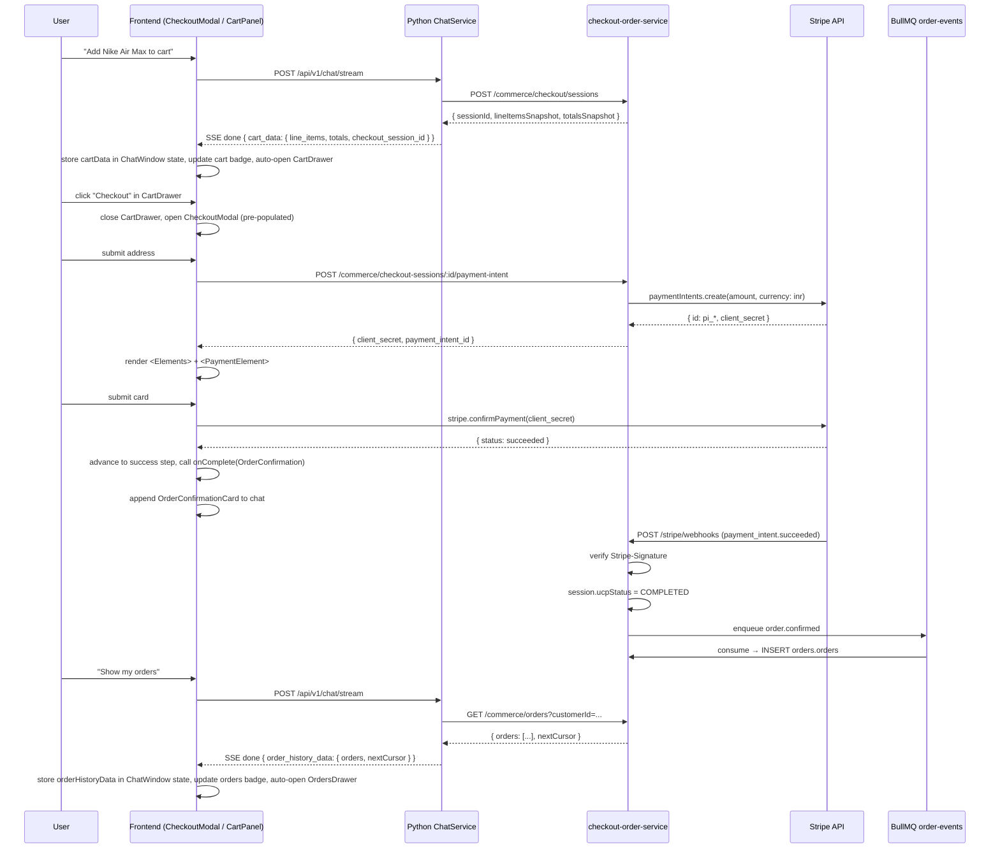

# Design Document: In-Chat Payment Orders

## Overview

This feature extends the Vikrai conversational shopping assistant with two capabilities:

1. **Embedded Stripe payment** — the existing `CheckoutModal` currently opens a Stripe Payment Link in a new browser tab. This design replaces that redirect with an inline `PaymentElement` rendered inside the modal using `@stripe/react-stripe-js`. Card data never touches our backend.

2. **In-chat cart management and order history** — a cart icon and an orders icon live in the top-right corner of the chat header. When the backend returns `cart_data` or `order_history_data` in the SSE `done` event, the frontend stores that data in `ChatWindow` state, updates the relevant icon's badge count, and auto-opens the corresponding slide-in side panel (`CartDrawer` or `OrdersDrawer`). The panels can also be toggled manually at any time. Every completed Stripe payment creates an `Order` record in `orders.orders` via the existing BullMQ `order.confirmed` pipeline.

### What already exists

The codebase already has most of the plumbing:

- `CheckoutModal` — multi-step modal with address collection and a polling-based "awaiting" step
- `checkout-order-service` — NestJS service with `CheckoutSessionService`, `StripeModule`, `createOrGetPaymentIntent`, and `handlePaymentSucceeded` methods (from the `stripe-payment-integration` spec)
- `orders.orders` PostgreSQL table and `OrderService`
- `CommerceClient` in the Python backend routing commerce intents
- `_handle_commerce_intent` / `_dispatch_commerce_intent` in `ChatService` handling `add_to_cart`, `view_cart`, `order_history`, etc.
- `OrderConfirmationCard` component and `addOrderConfirmation` hook in `useChat`
- `ChatMessageUI.checkoutData` and `ChatMessageUI.orderConfirmation` fields already in `chat.types.ts`

This design is therefore **additive and surgical** — it wires together existing pieces rather than building from scratch.

---

## Architecture



### Component Map

```
checkout-order-service/
  src/modules/
    stripe/
      stripe-webhook.controller.ts   ← already exists; handles payment_intent.succeeded
    checkout/session/
      checkout-session.service.ts    ← already has createOrGetPaymentIntent, handlePaymentSucceeded
      checkout.controller.ts         ← already has POST :id/payment-intent

backend/app/services/
  chat_service.py                    ← add order_history_data to SSE done event
                                       add cart_data to view_cart response

Frontend/components/
  CheckoutModal.tsx                  ← replace redirect/polling with Stripe Elements inline
  CartPanel.tsx                      ← NEW: renders cart items + Checkout button (inside CartDrawer)
  OrderHistoryPanel.tsx              ← NEW: renders paginated order list (inside OrdersDrawer)
  ChatWindow.tsx                     ← add cart/orders icons to header; manage CartDrawer/OrdersDrawer state
                                       store cartData and orderHistoryData from SSE events

Frontend/types/
  chat.types.ts                      ← add CartData, OrderHistoryData types
```

---

## Components and Interfaces

### 1. CheckoutModal — Stripe Elements inline payment

The existing `CheckoutModal` has steps: `select-address → address → redirecting → awaiting → success | failed`.

The new flow replaces `redirecting → awaiting` with a `payment` step:

```
select-address → address → payment → success | failed
```

**Step: `payment`**

After address submission, the modal calls `POST /commerce/checkout-sessions/:id/payment-intent` and stores `clientSecret` + `paymentIntentId` in component state. It then renders:

```tsx
<Elements stripe={stripePromise} options={{ clientSecret, appearance }}>
  <PaymentElement />
  <button onClick={handlePaymentSubmit}>Pay Now</button>
</Elements>
```

The `appearance` object matches the Vikrai dark theme (Requirement 8.1):

```typescript
const appearance: Appearance = {
  theme: "night",
  variables: {
    colorPrimary: "#1D9E75",
    colorBackground: "#0C0C0F",
    colorText: "rgba(255,255,255,0.82)",
    borderRadius: "12px",
  },
};
```

`stripePromise` is initialised once at module level:

```typescript
const stripePromise = process.env.NEXT_PUBLIC_STRIPE_PUBLISHABLE_KEY
  ? loadStripe(process.env.NEXT_PUBLIC_STRIPE_PUBLISHABLE_KEY)
  : null;
```

If `stripePromise` is `null`, the payment step renders an error state (Requirement 1.8, 9.3).

**`handlePaymentSubmit`** calls `stripe.confirmPayment({ elements, confirmParams: { return_url: window.location.href } })`. On error, displays `error.message` inline and stays on the `payment` step. On success, advances to `success` and calls `onComplete(orderConfirmation)`.

The existing `proceedToPayment` (which called `/payment-link` and opened a new tab) is replaced by `fetchPaymentIntent` which calls `/payment-intent` and transitions to the `payment` step.

The existing `awaiting` step (polling) is removed. The `payment-link` endpoint remains available for backward compatibility (Requirement 10.4) but is no longer called by the modal.

### 2. CartPanel + CartDrawer (new components)

`Frontend/components/CartPanel.tsx` — rendered inside a slide-in `CartDrawer` in `ChatWindow`.

```typescript
interface CartPanelProps {
  cartData: CartData;
  onCheckout: () => void;
}
```

Displays:
- List of line items: product title, quantity, unit price in INR
- Running subtotal: `sum(item.price × quantity) / 100` formatted as `₹X.XX`
- "Checkout" button that calls `onCheckout()` (closes drawer, opens CheckoutModal)

Design tokens: background `#111116`, border `rgba(255,255,255,0.07)`, border-radius `8px`, teal accent `#1D9E75`, Josefin Sans headings, Inter body (Requirement 4.8, 8.2).

The `CartDrawer` is a slide-in panel anchored to the right side of the chat window:
- Background `#0C0C0F`, left border `0.5px solid rgba(255,255,255,0.08)`
- Width: `320px` on desktop, full-width on mobile
- Slides in/out with a CSS transition (`transform: translateX`)
- Has a close button (`×`) in the top-right corner
- Overlays the message feed (position absolute/fixed within the chat container)

### 3. OrderHistoryPanel + OrdersDrawer (new components)

`Frontend/components/OrderHistoryPanel.tsx` — rendered inside a slide-in `OrdersDrawer` in `ChatWindow`.

```typescript
interface OrderHistoryPanelProps {
  data: OrderHistoryData;
  onLoadMore?: (cursor: string) => void;
}
```

Displays each order as a row: truncated order ID, status badge, grand total in INR, creation date. Orders are displayed in the order returned by the API (descending by `created_at`). A "Load more" button appears when `nextCursor` is present.

Status badge colors: teal (`#1D9E75`) for `processing`/`fulfilled`, red (`#f87171`) for `cancelled`/`payment_failed` (Requirement 5.7, 8.3).

The `OrdersDrawer` follows the same slide-in pattern as `CartDrawer`.

### 4. ChatWindow — header icons and drawer state

The chat header already has the Vikrai logo and a "LIVE" badge on the left. Two icon buttons are added to the **right side of the header**:

```tsx
{/* Top-right header icons */}
<div className="flex items-center gap-2 ml-auto">
  {/* Cart icon */}
  <button onClick={() => setCartOpen(o => !o)} className="relative ...">
    <ShoppingCartIcon />
    {cartItemCount > 0 && (
      <span className="badge">{cartItemCount}</span>
    )}
  </button>

  {/* Orders icon */}
  <button onClick={() => setOrdersOpen(o => !o)} className="relative ...">
    <ClipboardListIcon />
    {orderCount > 0 && (
      <span className="badge">{orderCount}</span>
    )}
  </button>
</div>
```

`ChatWindow` state additions:
```typescript
const [cartData, setCartData] = useState<CartData | null>(null);
const [orderHistoryData, setOrderHistoryData] = useState<OrderHistoryData | null>(null);
const [cartOpen, setCartOpen] = useState(false);
const [ordersOpen, setOrdersOpen] = useState(false);
```

When `useChat` delivers a message with `cartData` set, `ChatWindow` calls `setCartData` and `setCartOpen(true)`. Same pattern for `orderHistoryData` → `setOrdersOpen(true)`.

The drawers are rendered as absolutely-positioned overlays inside the chat container:
```tsx
{/* CartDrawer */}
<div
  className="absolute top-0 right-0 h-full z-20 transition-transform duration-300"
  style={{
    width: 320,
    background: "#0C0C0F",
    borderLeft: "0.5px solid rgba(255,255,255,0.08)",
    transform: cartOpen ? "translateX(0)" : "translateX(100%)",
  }}
>
  <CartPanel cartData={cartData} onCheckout={() => { setCartOpen(false); setCheckoutOpen(true); }} />
</div>
```

### 5. useChat.ts — SSE done event wiring

In both `sendMessage` and `streamRequest` SSE `done` handlers, extract `event.cart_data` and `event.order_history_data` alongside the existing `event.checkout_data`, and map them onto the bot `ChatMessageUI` as `cartData` and `orderHistoryData`. `ChatWindow` reads these fields off the message and updates its own drawer state.

The `handle_stream` method's `done` SSE event already carries `checkout_data`. Two additions:

**`view_cart` intent**: The `_dispatch_commerce_intent` method currently returns a stub for `view_cart`. It should call `CommerceClient.get_checkout_session` using the `checkout_session_id` stored in `session.context`. The `_handle_commerce_intent` method should attach `cart_data` to the response (analogous to how `checkout_data` is attached today).

**`order_history` intent**: After calling `CommerceClient.list_orders`, attach `order_history_data` to the response:

```python
if intent == "order_history" and service_response.success:
    response.order_history_data = {
        "orders": service_response.data.get("orders", []),
        "next_cursor": service_response.data.get("nextCursor"),
    }
```

The SSE `done` event in `handle_stream` already serialises all fields from `ChatResponse` — adding `order_history_data` and `cart_data` fields to `ChatResponse` DTO makes them flow through automatically.

### 6. checkout-order-service — existing endpoints (no changes needed)

The `stripe-payment-integration` spec already implemented:
- `POST /commerce/checkout-sessions/:id/payment-intent` → `createOrGetPaymentIntent`
- `POST /stripe/webhooks` → `handlePaymentSucceeded` → enqueue `order.confirmed`
- `order.confirmed` consumer → `OrderService.createFromEvent` → INSERT `orders.orders`

These are already in place. This feature only wires the frontend to use them correctly.

---

## Data Models

### Frontend type additions (`chat.types.ts`)

```typescript
export interface CartData {
  line_items: CheckoutLineItem[];
  totals: { subtotal_cents: number; tax_cents: number; grand_total_cents: number };
  checkout_session_id: string;
  saved_addresses?: SavedAddress[];
}

export interface OrderSummary {
  order_id: string;
  ucp_order_id?: string;
  status: string;
  totals: { grand_total_cents: number };
  created_at: string;
}

export interface OrderHistoryData {
  orders: OrderSummary[];
  next_cursor: string | null;
}

// Extend ChatMessageUI
export interface ChatMessageUI {
  // ... existing fields ...
  cartData?: CartData;           // replaces checkoutData for view_cart responses
  orderHistoryData?: OrderHistoryData;
}
```

Note: `checkoutData` (existing) is used for `checkout_initiate` responses that open the modal directly. `cartData` is used for `view_cart` responses that render the `CartPanel`. Both can coexist.

### Python ChatResponse DTO additions (`chat_dto.py`)

```python
class ChatResponse(BaseModel):
    # ... existing fields ...
    checkout_data: dict | None = None      # already exists
    cart_data: dict | None = None          # new: for view_cart
    order_history_data: dict | None = None # new: for order_history
```

### Session context schema (`sessions.context` JSONB)

The `checkout_session_id` is stored in `session.context` under the key `cart`:

```json
{
  "cart": {
    "checkout_session_id": "uuid",
    "line_items": [...],
    "totals": {...}
  }
}
```

This already exists in the codebase (`session.context.get("cart", {})`). No schema change needed.

### checkout-order-service — no new migrations

The `stripe-payment-integration` spec already added `stripe_payment_intent_id` and `stripe_client_secret` columns via migration `003_add_stripe_columns`. The `orders.orders` table already exists. No new migrations are required for this feature.

---

## Correctness Properties

*A property is a characteristic or behavior that should hold true across all valid executions of a system — essentially, a formal statement about what the system should do. Properties serve as the bridge between human-readable specifications and machine-verifiable correctness guarantees.*

### Property 1: Payment intent fetch replaces redirect

*For any* valid address form state in `CheckoutModal`, submitting the address step should result in exactly one call to `POST /commerce/checkout-sessions/:id/payment-intent` and zero calls to `window.open`.

**Validates: Requirements 1.1**

---

### Property 2: confirmPayment uses stored client_secret

*For any* `clientSecret` received from the payment-intent endpoint, submitting the payment form should call `stripe.confirmPayment` with that exact `clientSecret` — not a different value.

**Validates: Requirements 1.3**

---

### Property 3: Successful payment advances to success step

*For any* `stripe.confirmPayment` call that resolves without an error object, the `CheckoutModal` step should become `"success"` and no `window.location` navigation should occur.

**Validates: Requirements 1.4**

---

### Property 4: Payment error stays on payment step

*For any* `stripe.confirmPayment` call that returns an error, the `CheckoutModal` step should remain `"payment"`, the error message should be displayed, and the modal should not close.

**Validates: Requirements 1.5**

---

### Property 5: Submit button disabled while confirming

*For any* `CheckoutModal` state where `handlePaymentSubmit` has been called but has not yet resolved, the submit button should have `disabled = true`.

**Validates: Requirements 1.6**

---

### Property 6: No raw card data sent to backend

*For any* payment flow execution, all `fetch` calls made to the `checkout-order-service` backend should contain no `cardNumber`, `expiry`, `cvv`, or equivalent card data fields in their request bodies.

**Validates: Requirements 1.7**

---

### Property 7: PaymentIntent creation is idempotent

*For any* checkout session, calling `createOrGetPaymentIntent` a second time should return the same `client_secret` and `payment_intent_id` as the first call, and `stripe.paymentIntents.create` should be invoked at most once.

**Validates: Requirements 2.1**

---

### Property 8: PaymentIntent fields are persisted (round-trip)

*For any* checkout session, after `createOrGetPaymentIntent` returns, loading the session from the repository should show `stripePaymentIntentId` equal to the returned `payment_intent_id` and `stripeClientSecret` equal to the returned `client_secret`.

**Validates: Requirements 2.2**

---

### Property 9: PAYMENT_FAILED sessions allow retry

*For any* checkout session with `ucpStatus = PAYMENT_FAILED`, calling `createOrGetPaymentIntent` should succeed (not throw) and return a valid `{ client_secret, payment_intent_id }`.

**Validates: Requirements 2.5**

---

### Property 10: payment_intent.succeeded marks session COMPLETED and enqueues order

*For any* verified `payment_intent.succeeded` webhook event whose `payment_intent_id` matches a session, that session's `ucpStatus` should become `COMPLETED` and exactly one `order.confirmed` job should be added to the `order-events` queue.

**Validates: Requirements 3.1**

---

### Property 11: order.confirmed event creates Order record

*For any* `order.confirmed` event consumed from the queue, an `Order` record should be inserted into `orders.orders` with `status = "processing"`, the correct `customerId`, `lineItems`, and `totals` from the event payload.

**Validates: Requirements 3.2**

---

### Property 12: payment_intent.payment_failed marks session PAYMENT_FAILED

*For any* verified `payment_intent.payment_failed` webhook event whose `payment_intent_id` matches a session, that session's `ucpStatus` should become `PAYMENT_FAILED`.

**Validates: Requirements 3.3**

---

### Property 13: Webhook signature verified before business logic

*For any* request to `POST /stripe/webhooks`, `stripe.webhooks.constructEvent` must be called with the raw request body and the `stripe-signature` header before any session mutation or queue operation executes. Requests with invalid signatures should return HTTP 400.

**Validates: Requirements 3.4**

---

### Property 14: add_to_cart routes to correct CommerceClient method

*For any* `add_to_cart` intent with a resolved `product_id`, if no active session exists the `ChatService` should call `CommerceClient.create_checkout_session`; if an active session exists it should call `CommerceClient.update_checkout_session` — never the wrong method.

**Validates: Requirements 4.1**

---

### Property 15: CartPanel subtotal equals sum of line item prices

*For any* list of line items, the subtotal displayed by `CartPanel` should equal `sum(item.price × quantity)` for all items in the list, converted from cents to INR display format.

**Validates: Requirements 4.5**

---

### Property 16: out_of_stock error leaves cart unchanged

*For any* `add_to_cart` intent where the `checkout-order-service` returns an `out_of_stock` error, the `ChatService` should return an error message and the session's `lineItemsSnapshot` should be identical to its state before the call.

**Validates: Requirements 4.6**

---

### Property 17: order_history scoped to authenticated customer

*For any* `order_history` query with a given `customer_id`, all returned orders should have `customerId` equal to that `customer_id` — no orders belonging to a different customer should appear.

**Validates: Requirements 5.4**

---

### Property 18: OrderHistoryPanel orders are in descending date order

*For any* list of orders returned by `CommerceClient.list_orders`, the `OrderHistoryPanel` should render them in descending `created_at` order (newest first).

**Validates: Requirements 5.3**

---

### Property 19: Successful payment triggers onComplete and OrderConfirmationCard

*For any* `CheckoutModal` that advances to the `success` step, `onComplete` should be called with a valid `OrderConfirmation` object, and the `ChatWindow` should append an `OrderConfirmationCard` message to the chat feed.

**Validates: Requirements 6.1, 6.2**

---

### Property 20: OrderConfirmationCard renders all required fields

*For any* `OrderConfirmation` object, the rendered `OrderConfirmationCard` should display the `order_id`, each line item's title and quantity, each line item's price, the grand total in INR, and a status badge.

**Validates: Requirements 6.3**

---

### Property 21: Active session is reused across cart intents

*For any* customer with an active `CheckoutSession` (status not `completed` or `canceled`), subsequent `add_to_cart` or `view_cart` intents should use the same `checkout_session_id` stored in `session.context`, not create a new session.

**Validates: Requirements 7.1, 7.2**

---

### Property 22: /complete endpoint accepts both payload types (backward compat)

*For any* call to `POST /commerce/checkout-sessions/:id/complete` with either `{ type: "stripe", payment_intent_id: string }` or `{ type: "card", last4: string }` as the `payment_instrument`, the endpoint should return HTTP 200 without error.

**Validates: Requirements 10.3**

---

## Error Handling

| Scenario | Component | Behaviour |
|---|---|---|
| `NEXT_PUBLIC_STRIPE_PUBLISHABLE_KEY` absent | `CheckoutModal` | Renders error state on payment step: "Payment is currently unavailable" |
| `POST /payment-intent` returns 404 | `CheckoutModal` | Shows error on address step, stays on address step |
| `POST /payment-intent` returns 422 (CANCELED session) | `CheckoutModal` | Shows "This checkout session has expired. Please start over." |
| `stripe.confirmPayment` returns error | `CheckoutModal` | Displays `error.message` inline on payment step, button re-enabled |
| `stripe.confirmPayment` network failure | `CheckoutModal` | Displays generic error, stays on payment step |
| Stripe webhook signature invalid | `StripeWebhookController` | HTTP 400, log warning, no state change |
| Webhook `payment_intent_id` not found in DB | `CheckoutSessionService` | Log warning, return without throwing (Stripe retries; idempotent) |
| `CommerceClient.list_orders` returns empty | `ChatService` | Returns "You haven't placed any orders yet." message |
| `CommerceClient.create_checkout_session` returns `out_of_stock` | `ChatService` | Returns "Sorry, that item is currently out of stock." |
| `checkout-order-service` unreachable | `ChatService` | Returns "The commerce service is temporarily unavailable. Please try again." |
| `STRIPE_SECRET_KEY` absent at startup | `StripeModule` factory | Throws `Error`, service refuses to start |
| `SKIP_UCP_OUTBOUND=true` + `STRIPE_SECRET_KEY` absent | `CheckoutSessionService` | Logs warning, falls back to fake-complete; modal advances to success |

---

## Testing Strategy

### Dependencies

**Frontend** — add to `dependencies` (if not already present from `stripe-payment-integration`):
```
@stripe/stripe-js: ^4.x
@stripe/react-stripe-js: ^2.x
```

### Unit Testing

Use Jest (checkout-order-service) and Vitest (Frontend). Mock Stripe SDK and TypeORM repositories.

Focus areas:
- `CheckoutModal`: address submit calls `/payment-intent`; payment step renders `PaymentElement`; `confirmPayment` called with correct `clientSecret`; success step on resolved payment; error displayed on rejected payment; button disabled while submitting; no card data in backend requests
- `CartPanel`: subtotal calculation for arbitrary line item lists; "Checkout" button calls `onCheckout`
- `OrderHistoryPanel`: renders all required order fields; "Load more" appears when `nextCursor` present
- `ChatService._dispatch_commerce_intent`: `view_cart` calls `get_checkout_session`; `order_history` calls `list_orders`; `add_to_cart` calls correct method based on session existence
- `CheckoutSessionService.createOrGetPaymentIntent`: idempotence; persistence; 404/422 guards; PAYMENT_FAILED sessions allowed
- `StripeWebhookController`: signature verified before business logic; correct status transitions; 400 on bad signature

### Property-Based Testing

The project already uses `fast-check` in both `checkout-order-service` and `Frontend`. Use `fc.assert` with `fc.asyncProperty` for async properties. Minimum 100 runs per property.

Each property test must include a comment tag:
```
// Feature: in-chat-payment-orders, Property <N>: <property_text>
```

**Backend property tests** (Jest + fast-check):

| Property | Generator | Assertion |
|---|---|---|
| P7: PaymentIntent idempotency | `fc.uuid()` for sessionId, pre-seeded with existing PI | Second call returns same `client_secret`; `paymentIntents.create` called once |
| P8: Persistence round-trip | `fc.uuid()` for sessionId | After call, `repo.findOne` returns session with both Stripe fields set |
| P9: PAYMENT_FAILED allows retry | `fc.uuid()` for sessionId, session pre-set to PAYMENT_FAILED | `createOrGetPaymentIntent` resolves without throwing |
| P10: succeeded → COMPLETED + enqueue | `fc.string()` for `pi_id` | Session status = COMPLETED; `queue.add` called once with `order.confirmed` |
| P11: order.confirmed → Order record | `fc.record(...)` for event payload | `orders.orders` INSERT with correct `customerId`, `status = "processing"` |
| P12: failed → PAYMENT_FAILED | `fc.string()` for `pi_id` | Session status = PAYMENT_FAILED |
| P13: Signature verified first | Any webhook body | `constructEvent` called before any `repo.save` or `queue.add` |
| P17: Customer isolation | `fc.uuid()` for `customerId` | All returned orders have matching `customerId` |
| P22: Backward-compat /complete | `fc.oneof(stripePayload, legacyCardPayload)` | Response HTTP 200 |

**Frontend property tests** (Vitest + fast-check):

| Property | Generator | Assertion |
|---|---|---|
| P1: No window.open on address submit | `fc.record({ fullName, addressLine, city, pincode })` | `window.open` not called; `fetch` called with `/payment-intent` URL |
| P2: confirmPayment uses stored clientSecret | `fc.string()` for `clientSecret` | `stripe.confirmPayment` called with matching `clientSecret` |
| P4: Error stays on payment step | `fc.string()` for error message | Step remains `"payment"`; error text rendered |
| P6: No card data in backend requests | Any payment flow | All `fetch` calls to backend contain no `cardNumber`/`expiry`/`cvv` |
| P15: CartPanel subtotal | `fc.array(fc.record({ price: fc.integer({min:1}), quantity: fc.integer({min:1}) }))` | Displayed subtotal = `sum(price × quantity)` |
| P18: OrderHistoryPanel descending order | `fc.array(fc.record({ created_at: fc.date() }), { minLength: 2 })` | Rendered order matches descending sort by `created_at` |
| P19: onComplete called on success | Any successful `confirmPayment` mock | `onComplete` called with `OrderConfirmation`; `OrderConfirmationCard` appended |
| P20: OrderConfirmationCard fields | `fc.record(...)` for `OrderConfirmation` | Rendered output contains `order_id`, all item titles, grand total, status |
| P21: Session reuse | `fc.uuid()` for existing `checkout_session_id` in context | `create_checkout_session` not called; `update_checkout_session` called with existing ID |

### Integration / E2E

The existing `checkout-order-service/test/` directory has e2e specs using Supertest. Add:
- `in-chat-payment.e2e-spec.ts`: full webhook ingestion path — mock Stripe SDK, verify session status transitions and `order.confirmed` enqueue end-to-end.
