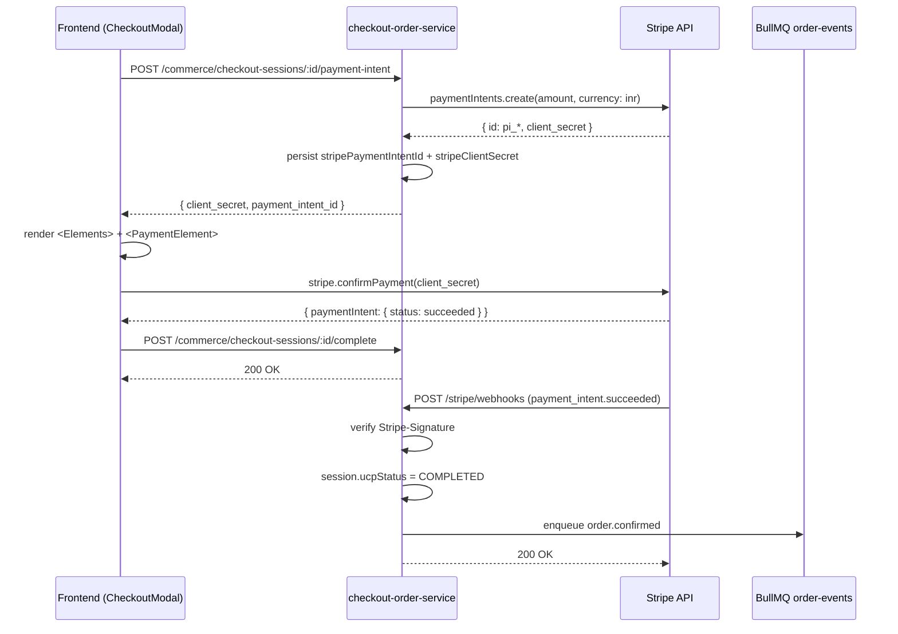

# Design Document: Stripe Payment Integration

## Overview

This design integrates Stripe sandbox payments end-to-end into the Vik Rai conversational shopping assistant. The current checkout flow uses a fake card form and marks sessions as completed locally. This integration replaces that with a real Stripe payment flow:

1. Frontend CheckoutModal collects a shipping address
2. On advancing to the payment step, the frontend requests a Stripe PaymentIntent from the backend
3. The backend creates the PaymentIntent via the Stripe SDK and persists the `payment_intent_id` on the `CheckoutSession` entity
4. The frontend renders Stripe Elements (PaymentElement) for PCI-compliant card capture
5. The user submits; the frontend calls `stripe.confirmPayment` — card data never touches our backend
6. Stripe fires a `payment_intent.succeeded` webhook to the backend
7. The backend marks the session `COMPLETED` and enqueues an `order.confirmed` event on the BullMQ `order-events` queue
8. The frontend calls `/complete` with the `payment_intent_id`, then advances to the success step

The integration is additive: the existing `SKIP_UCP_OUTBOUND` dev mode and the `/complete` endpoint remain backward-compatible.

---

## Architecture



### Module Boundaries

```
checkout-order-service/
  src/
    modules/
      stripe/                    ← new StripeModule
        stripe.module.ts
        stripe.provider.ts
        stripe-webhook.controller.ts
      checkout/
        session/
          checkout-session.entity.ts   ← +2 columns
          checkout-session.service.ts  ← +createOrGetPaymentIntent
          checkout.controller.ts       ← +POST :id/payment-intent
    migrations/checkout/
      003_add_stripe_columns.ts        ← new migration
    shared/types/
      ucp-checkout-status.enum.ts      ← +PAYMENT_FAILED

Frontend/
  components/
    CheckoutModal.tsx                  ← replace card inputs with Stripe Elements
```

---

## Components and Interfaces

### StripeModule (checkout-order-service)

A NestJS module that wraps the Stripe Node.js SDK as a singleton injectable provider.

```typescript
// stripe.provider.ts
export const STRIPE_CLIENT = 'STRIPE_CLIENT';

export const stripeProvider: FactoryProvider = {
  provide: STRIPE_CLIENT,
  useFactory: (config: ConfigService) => {
    const key = config.get<string>('STRIPE_SECRET_KEY');
    if (!key) throw new Error('STRIPE_SECRET_KEY is required');
    return new Stripe(key, { apiVersion: '2024-06-20' });
  },
  inject: [ConfigService],
};
```

`StripeModule` is a `@Global()` module so any other module can inject `STRIPE_CLIENT` without importing `StripeModule` explicitly. It exports `stripeProvider` and registers `StripeWebhookController`.

### StripeWebhookController

```
POST /stripe/webhooks
```

- Decorated with `@Controller('stripe')` — outside the `commerce/` prefix
- Uses `@Req() req: RawBodyRequest<Request>` to access `req.rawBody` (already enabled in `main.ts` via `rawBody: true`)
- Reads `stripe-signature` header
- Calls `stripe.webhooks.constructEvent(rawBody, sig, STRIPE_WEBHOOK_SECRET)`
- On `payment_intent.succeeded`: calls `checkoutSessionService.handlePaymentSucceeded(paymentIntentId)`
- On `payment_intent.payment_failed`: calls `checkoutSessionService.handlePaymentFailed(paymentIntentId, lastPaymentError)`
- All other event types: returns 200 immediately
- Signature failure: returns 400

### CheckoutSessionService — new methods

```typescript
// Create or return existing PaymentIntent for a session
async createOrGetPaymentIntent(sessionId: string): Promise<{ client_secret: string; payment_intent_id: string }>

// Called by StripeWebhookController on payment_intent.succeeded
async handlePaymentSucceeded(paymentIntentId: string): Promise<void>

// Called by StripeWebhookController on payment_intent.payment_failed
async handlePaymentFailed(paymentIntentId: string, reason: string | null): Promise<void>
```

`createOrGetPaymentIntent` logic:
1. Load session (throws 404 if not found)
2. Assert not CANCELED (throws 422)
3. If `session.stripePaymentIntentId` is already set, return `{ client_secret: session.stripeClientSecret, payment_intent_id: session.stripePaymentIntentId }`
4. Call `stripe.paymentIntents.create({ amount: session.totalsSnapshot.grand_total_cents, currency: 'inr', metadata: { checkout_session_id: sessionId } })`
5. Persist `stripePaymentIntentId` and `stripeClientSecret` on the session
6. Return `{ client_secret, payment_intent_id }`

`handlePaymentSucceeded` logic:
1. Find session by `stripePaymentIntentId`
2. Set `ucpStatus = COMPLETED`, set `ucpOrderId = randomUUID()` (local dev) or use existing
3. Save session
4. Call `handleCompleted(session)` to enqueue `order.confirmed`

`handlePaymentFailed` logic:
1. Find session by `stripePaymentIntentId`
2. Set `ucpStatus = PAYMENT_FAILED`
3. Save session
4. Log the failure reason

### CheckoutController — new endpoint

```
POST /commerce/checkout-sessions/:id/payment-intent
```

Delegates to `checkoutSessionService.createOrGetPaymentIntent(id)` and returns the result directly. Existing `CommerceException` error handling propagates 404 and 422 automatically.

### Frontend CheckoutModal changes

The payment step is refactored:

1. `handleAddressSubmit` — after advancing to payment step, immediately calls `POST /commerce/checkout-sessions/:id/payment-intent` and stores `clientSecret` + `paymentIntentId` in component state. On failure, stays on address step and shows error.
2. Payment step renders `<Elements stripe={stripePromise} options={{ clientSecret }}>` wrapping a `<PaymentElement />` instead of the plain card inputs.
3. `handlePaymentSubmit` — calls `stripe.confirmPayment({ elements, confirmParams: { return_url: ... } })`. On error, shows inline error. On success, advances to confirm step.
4. `handleConfirm` — calls `/complete` with `{ payment_instrument: { type: "stripe", payment_intent_id } }`.

`stripePromise` is initialised once at module level:
```typescript
import { loadStripe } from '@stripe/stripe-js';
const stripePromise = process.env.NEXT_PUBLIC_STRIPE_PUBLISHABLE_KEY
  ? loadStripe(process.env.NEXT_PUBLIC_STRIPE_PUBLISHABLE_KEY)
  : null;
```

If `stripePromise` is null, the payment step renders an error state.

---

## Data Models

### CheckoutSession entity — new columns

```typescript
@Column({ name: 'stripe_payment_intent_id', type: 'varchar', nullable: true })
stripePaymentIntentId: string | null;

@Column({ name: 'stripe_client_secret', type: 'text', nullable: true })
stripeClientSecret: string | null;
```

### UcpCheckoutStatus enum — new value

```typescript
PAYMENT_FAILED = 'payment_failed',
```

### Migration: 003_add_stripe_columns

```typescript
export class AddStripeColumnsToCheckoutSessions1700000000003 implements MigrationInterface {
  name = 'AddStripeColumnsToCheckoutSessions1700000000003';

  async up(queryRunner: QueryRunner): Promise<void> {
    await queryRunner.query(`
      ALTER TABLE checkout.checkout_sessions
        ADD COLUMN stripe_payment_intent_id VARCHAR(255),
        ADD COLUMN stripe_client_secret TEXT
    `);
    await queryRunner.query(`
      CREATE UNIQUE INDEX idx_checkout_sessions_stripe_pi_id
        ON checkout.checkout_sessions(stripe_payment_intent_id)
        WHERE stripe_payment_intent_id IS NOT NULL
    `);
  }

  async down(queryRunner: QueryRunner): Promise<void> {
    await queryRunner.query(`DROP INDEX IF EXISTS checkout.idx_checkout_sessions_stripe_pi_id`);
    await queryRunner.query(`
      ALTER TABLE checkout.checkout_sessions
        DROP COLUMN IF EXISTS stripe_payment_intent_id,
        DROP COLUMN IF EXISTS stripe_client_secret
    `);
  }
}
```

### CompleteCheckoutSessionDto — updated

The existing DTO accepts `payment_instrument: unknown`. The `/complete` endpoint now also accepts `{ type: "stripe", payment_intent_id: string }` alongside the legacy `{ type: "card", last4: string }`. No DTO change is required since the field is typed as `unknown`; the service ignores the instrument in `SKIP_UCP_OUTBOUND` mode.

### Environment variables

**checkout-order-service/.env** (new entries):
```
# ── Stripe ────────────────────────────────────────────────────────────────────
# Obtain from https://dashboard.stripe.com/test/apikeys
STRIPE_SECRET_KEY=sk_test_...
# Obtain from https://dashboard.stripe.com/test/webhooks after registering the endpoint
STRIPE_WEBHOOK_SECRET=whsec_...
```

**Frontend/.env.local** (new entry):
```
# Obtain from https://dashboard.stripe.com/test/apikeys
NEXT_PUBLIC_STRIPE_PUBLISHABLE_KEY=pk_test_...
```

---

## Correctness Properties

*A property is a characteristic or behavior that should hold true across all valid executions of a system — essentially, a formal statement about what the system should do. Properties serve as the bridge between human-readable specifications and machine-verifiable correctness guarantees.*

### Property 1: PaymentIntent creation uses session amount and INR currency

*For any* checkout session with a valid `totalsSnapshot.grand_total_cents`, calling `createOrGetPaymentIntent` should invoke `stripe.paymentIntents.create` with `amount` equal to `grand_total_cents` and `currency` equal to `"inr"`.

**Validates: Requirements 2.1**

---

### Property 2: PaymentIntent creation is idempotent

*For any* checkout session, calling `createOrGetPaymentIntent` a second time should return the same `client_secret` and `payment_intent_id` as the first call, and should not invoke `stripe.paymentIntents.create` more than once.

**Validates: Requirements 2.6**

---

### Property 3: PaymentIntent fields are persisted (round-trip)

*For any* checkout session, after `createOrGetPaymentIntent` returns, loading the session from the repository should show `stripePaymentIntentId` equal to the returned `payment_intent_id` and `stripeClientSecret` equal to the returned `client_secret`.

**Validates: Requirements 2.5, 3.3**

---

### Property 4: Address submission triggers payment-intent API call

*For any* valid address form state in CheckoutModal, submitting the address step should result in exactly one call to `POST /commerce/checkout-sessions/:id/payment-intent` before the payment step is rendered.

**Validates: Requirements 4.2**

---

### Property 5: Payment submission calls stripe.confirmPayment with stored client_secret

*For any* payment step state where a `clientSecret` has been received, submitting the payment form should call `stripe.confirmPayment` with that exact `clientSecret`.

**Validates: Requirements 4.5**

---

### Property 6: No raw card data is sent to any backend endpoint

*For any* payment flow execution, all network requests made to the checkout-order-service backend should contain no card number, expiry, or CVV fields in their request bodies.

**Validates: Requirements 4.8**

---

### Property 7: All webhook requests undergo signature verification

*For any* request to `POST /stripe/webhooks`, `stripe.webhooks.constructEvent` must be called with the raw request body and the `stripe-signature` header before any business logic executes.

**Validates: Requirements 5.2**

---

### Property 8: payment_intent.succeeded marks session COMPLETED and enqueues order.confirmed

*For any* verified `payment_intent.succeeded` webhook event whose `payment_intent_id` matches a session, that session's `ucpStatus` should become `COMPLETED` and exactly one `order.confirmed` job should be added to the `order-events` queue.

**Validates: Requirements 5.4**

---

### Property 9: payment_intent.payment_failed marks session PAYMENT_FAILED

*For any* verified `payment_intent.payment_failed` webhook event whose `payment_intent_id` matches a session, that session's `ucpStatus` should become `PAYMENT_FAILED`.

**Validates: Requirements 5.5, 6.2**

---

### Property 10: Unrecognised webhook event types return 200 with no side effects

*For any* verified webhook event whose type is not `payment_intent.succeeded` or `payment_intent.payment_failed`, the controller should return HTTP 200 and no session should be modified and no queue job should be enqueued.

**Validates: Requirements 5.6**

---

### Property 11: PAYMENT_FAILED sessions allow a new PaymentIntent to be created

*For any* checkout session with `ucpStatus = PAYMENT_FAILED`, calling `createOrGetPaymentIntent` should succeed (not throw) and return a valid `{ client_secret, payment_intent_id }`.

**Validates: Requirements 6.3**

---

### Property 12: Successful confirmPayment calls /complete with correct payload shape

*For any* successful `stripe.confirmPayment` result, the CheckoutModal should call `POST /commerce/checkout-sessions/:id/complete` with a body of `{ payment_instrument: { type: "stripe", payment_intent_id: <the pi_* id> } }`.

**Validates: Requirements 7.1**

---

### Property 13: Submit button is disabled while payment confirmation is in progress

*For any* CheckoutModal state where `handleConfirm` has been called but has not yet resolved, the confirm button should be disabled and a loading indicator should be visible.

**Validates: Requirements 7.4**

---

### Property 14: /complete endpoint accepts both stripe and legacy card payloads

*For any* call to `POST /commerce/checkout-sessions/:id/complete` with either `{ type: "stripe", payment_intent_id: string }` or `{ type: "card", last4: string }` as the `payment_instrument`, the endpoint should return HTTP 200 without error.

**Validates: Requirements 9.3**

---

## Error Handling

| Scenario | Component | Response |
|---|---|---|
| `STRIPE_SECRET_KEY` absent at startup | StripeModule factory | Throws `Error`, service refuses to start |
| Session not found in `createOrGetPaymentIntent` | CheckoutSessionService | `CommerceException` → HTTP 404 |
| Session is CANCELED in `createOrGetPaymentIntent` | CheckoutSessionService | `CommerceException` → HTTP 422 |
| Stripe API error during PaymentIntent creation | CheckoutSessionService | Propagates as HTTP 502 (wrap in `CommerceException`) |
| Webhook signature verification failure | StripeWebhookController | HTTP 400, log warning |
| Webhook `payment_intent_id` not found in DB | CheckoutSessionService | Log warning, return without throwing (Stripe will retry; idempotent) |
| `NEXT_PUBLIC_STRIPE_PUBLISHABLE_KEY` absent | CheckoutModal | Renders error state, payment step unavailable |
| `stripe.confirmPayment` returns error | CheckoutModal | Display `error.message` inline, stay on payment step |
| `/complete` returns non-200 | CheckoutModal | Display error message, stay on confirm step |
| `SKIP_UCP_OUTBOUND=true` and `STRIPE_SECRET_KEY` absent | CheckoutSessionService | Log warning, fall back to fake-complete behaviour |

---

## Testing Strategy

### Dependencies

**checkout-order-service** — add to `dependencies`:
```
stripe: ^16.x
```

**Frontend** — add to `dependencies`:
```
@stripe/stripe-js: ^4.x
@stripe/react-stripe-js: ^2.x
```

### Unit Testing

Unit tests use Jest (already configured) with mocked Stripe SDK and mocked TypeORM repository.

Focus areas:
- `StripeModule` factory: throws when `STRIPE_SECRET_KEY` is absent/empty; passes correct `apiVersion`
- `CheckoutSessionService.createOrGetPaymentIntent`: correct Stripe call params; idempotence; persistence; 404/422 guards; PAYMENT_FAILED sessions allowed
- `StripeWebhookController`: signature verification called for every request; correct status transitions per event type; 400 on bad signature; 200 + no-op for unknown events
- `CheckoutModal`: address submission triggers payment-intent fetch; payment step renders `PaymentElement`; confirm step calls `/complete` with correct payload; loading state disables button

### Property-Based Testing

The project already uses `fast-check` in both `checkout-order-service` (devDependencies) and `Frontend` (devDependencies). Use `fc.assert` with `fc.asyncProperty` for async properties.

Minimum 100 runs per property (fast-check default is 100).

Each property test must include a comment tag:
```
// Feature: stripe-payment-integration, Property <N>: <property_text>
```

**Backend property tests** (Jest + fast-check, in `checkout-order-service/test/` or `src/**/*.spec.ts`):

| Property | Generator | Assertion |
|---|---|---|
| P1: Amount and currency | `fc.integer({ min: 1 })` for grand_total_cents | `stripe.paymentIntents.create` called with `{ amount: cents, currency: 'inr' }` |
| P2: Idempotence | `fc.uuid()` for sessionId, pre-seeded with existing pi | Second call returns same `client_secret`; create called once |
| P3: Persistence round-trip | `fc.uuid()` for sessionId | After call, repo.findOne returns session with both fields set |
| P8: succeeded → COMPLETED + enqueue | `fc.string()` for pi_id | Session status = COMPLETED; queue.add called once with `order.confirmed` |
| P9: failed → PAYMENT_FAILED | `fc.string()` for pi_id | Session status = PAYMENT_FAILED |
| P10: Unknown event → 200, no side effects | `fc.string().filter(s => !['payment_intent.succeeded','payment_intent.payment_failed'].includes(s))` | Response 200; no repo.save; no queue.add |
| P11: PAYMENT_FAILED allows retry | `fc.uuid()` for sessionId, session pre-set to PAYMENT_FAILED | `createOrGetPaymentIntent` resolves without throwing |
| P14: Backward-compatible /complete | `fc.oneof(stripePayload, legacyCardPayload)` | Response 200 |

**Frontend property tests** (Vitest + fast-check, in `Frontend/__tests__/`):

| Property | Generator | Assertion |
|---|---|---|
| P4: Address submit triggers API call | `fc.record({ fullName, addressLine, city, pincode })` | `fetch` called with URL containing `/payment-intent` |
| P5: confirmPayment receives stored clientSecret | `fc.string()` for clientSecret | `stripe.confirmPayment` called with matching `clientSecret` |
| P6: No card data in backend requests | Any payment flow execution | All `fetch` calls to backend contain no `cardNumber`/`expiry`/`cvv` fields |
| P12: /complete payload shape | `fc.string()` for paymentIntentId | `fetch` body contains `{ payment_instrument: { type: "stripe", payment_intent_id } }` |
| P13: Button disabled during in-progress | Any confirm state | While `handleConfirm` is pending, button `disabled` attribute is true |

### Integration / E2E

The existing `test/` directory contains e2e specs using Supertest. Add:
- `stripe-webhook.e2e-spec.ts`: tests the full webhook ingestion path against a real in-memory NestJS app with a mocked Stripe SDK, verifying session status transitions end-to-end.
