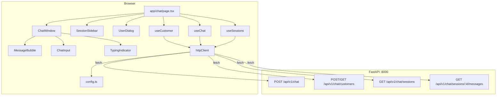
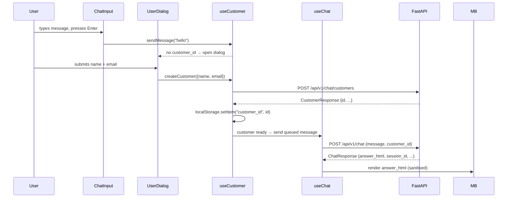
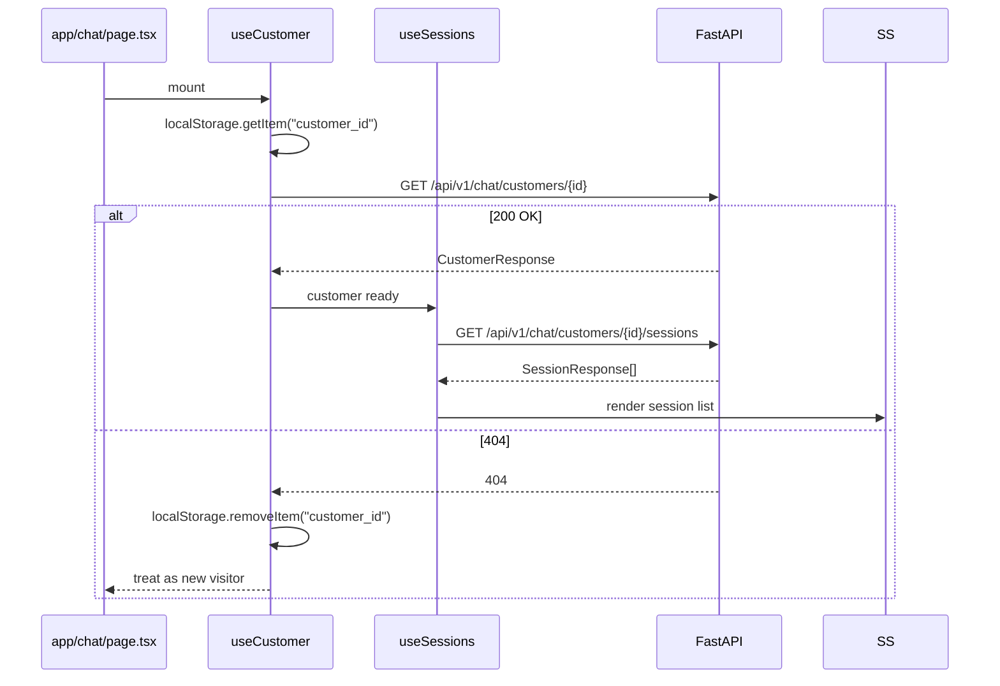

# Design Document: frontend-chat-integration

## Overview

This design replaces the current mock-only Next.js chat frontend with a fully integrated implementation that communicates with the Python FastAPI backend. The integration introduces:

- A centralised `config.ts` module for all endpoint URLs
- A real `fetch`-based HTTP client replacing the existing `MockHttpClient`
- Three custom hooks (`useCustomer`, `useChat`, `useSessions`) that own all API interaction and state
- New components: `UserDialog`, `SessionSidebar`, `MessageBubble`
- HTML sanitisation for `answer_html` bot responses
- Removal of all mock data, mock delays, and product card rendering

The backend exposes a REST API at `/api/v1/chat` (FastAPI, Python). The frontend is a Next.js 14 app using React Query for async state, Tailwind CSS for styling, and Framer Motion for animation.

---

## Architecture



### Data flow for a new visitor sending their first message



### Data flow for a returning visitor



---

## Components and Interfaces

### File / Folder Structure

```
Frontend/
├── app/
│   ├── chat/
│   │   └── page.tsx          ← composes ChatWindow + SessionSidebar + UserDialog
│   ├── layout.tsx
│   └── providers.tsx
├── components/
│   ├── ChatWindow.tsx         ← message list + scroll anchor
│   ├── MessageBubble.tsx      ← renders answer_html safely (replaces ChatMessage)
│   ├── ProductSlider.tsx      ← horizontal scrollable product card carousel
│   ├── SuggestionChips.tsx    ← tappable suggestion pill row
│   ├── ChatInput.tsx          ← text input + send button
│   ├── TypingIndicator.tsx    ← animated dots
│   ├── SessionSidebar.tsx     ← session list with skeleton loader
│   ├── UserDialog.tsx         ← name/email modal for first-time visitors
│   └── ui/
│       ├── button.tsx
│       └── input.tsx
├── hooks/
│   ├── useCustomer.ts         ← customer identity, localStorage, API
│   ├── useChat.ts             ← message list, send message, typing state
│   └── useSessions.ts         ← session list, session selection, history load
├── services/
│   ├── httpClient.ts          ← real fetch-based client
│   └── httpMethods.ts         ← GET / POST helpers
├── config/
│   └── config.ts              ← apiBaseUrl, API_PREFIX, endpoints
└── types/
    └── chat.types.ts          ← TypeScript interfaces matching backend DTOs
```

### Component Designs

#### `app/chat/page.tsx`

Composes the three top-level concerns. Passes hook return values as props.

```tsx
"use client";
export default function ChatPage() {
  const customer = useCustomer();
  const sessions = useSessions(customer.customerId);
  const chat     = useChat(customer.customerId, sessions.activeSessionId);

  return (
    <main ...>
      <SessionSidebar {...sessions} />
      <ChatWindow {...chat} inputDisabled={customer.isLoading} />
      <UserDialog
        open={customer.dialogOpen}
        onSubmit={customer.createCustomer}
        error={customer.error}
      />
    </main>
  );
}
```

#### `ChatWindow`

Renders the message list, `TypingIndicator`, and `ChatInput`. Receives all state via props — no direct API calls.

Props:
```ts
interface ChatWindowProps {
  messages: ChatMessageUI[];
  sendMessage: (text: string) => void;
  isLoading: boolean;
  isTyping: boolean;
  inputDisabled: boolean;
  sessionEnded: boolean;
  bottomRef: React.RefObject<HTMLDivElement>;
}
```

#### `MessageBubble`

Replaces `ChatMessage`. Renders `answer_html` via `dangerouslySetInnerHTML` after sanitisation with DOMPurify. Falls back to plain `answer` text when `answer_html` is absent or empty.

Props:
```ts
interface MessageBubbleProps {
  message: ChatMessageUI;
}
// ChatMessageUI.answerHtml?: string  — sanitised before render
// ChatMessageUI.content: string      — plain text fallback
```

#### `SessionSidebar`

Renders a list of `SessionResponse` entries. Shows a skeleton loader while `isLoading` is true.

Props:
```ts
interface SessionSidebarProps {
  sessions: SessionResponse[];
  activeSessionId: string | null;
  isLoading: boolean;
  onSelectSession: (sessionId: string) => void;
}
```

#### `UserDialog`

A modal (Radix Dialog or simple overlay) that collects name and email. Delegates submission to `useCustomer`.

Props:
```ts
interface UserDialogProps {
  open: boolean;
  onSubmit: (name: string, email: string) => Promise<void>;
  error: string | null;
}
```

#### `ChatInput`

Unchanged interface — `onSend` callback + `disabled` flag. The `disabled` prop now also covers `sessionEnded`.

#### `TypingIndicator`

Unchanged — animated dots, no props needed.

---

#### `ProductSlider` (new)

A horizontal scrollable card carousel rendered below a bot `MessageBubble` when `cited_products` is non-empty. Built with shadcn `Card` primitives and a CSS scroll-snap container.

Each card shows:
- Product image (`productImageUrl`) with a fallback placeholder
- Product name (`productName`) truncated to 2 lines
- Price formatted as currency
- Star rating
- "Preview" button (opens product URL in a new tab — future use, can be a no-op initially)
- A selectable state: clicking a card highlights it and queues the product for sending

Selection behaviour:
- Only one product can be selected at a time (single-select)
- When selected, a "Send" button appears below the slider (or the card itself becomes a send trigger)
- Clicking send calls `sendMessage` with `message = productId` (sent to API) but displays `productName` as the user bubble text in the UI
- After sending, the selection is cleared

Props:
```ts
interface ProductSliderProps {
  products: ProductCardDTO[];
  onSelectProduct: (productId: string, productName: string) => void;
}
```

`onSelectProduct` is wired to a specialised `sendProductMessage(productId, productName)` exposed by `useChat`. Internally `sendProductMessage` calls `POST /api/v1/chat` with `message: productId` but appends a user bubble with `content: productName` to the local message list.

#### `SuggestionChips` (new)

A row of tappable pill buttons rendered below the `ProductSlider` (or directly below the bot bubble when no products are present). Shown only when `suggestions` is non-empty.

Each chip shows `icon + label`. Clicking a chip calls `sendMessage(chip.message)` — the full `message` field is sent to the API and also displayed as the user bubble text.

Props:
```ts
interface SuggestionChipsProps {
  suggestions: SuggestionChip[];
  onSelectSuggestion: (message: string) => void;
}
```

After a chip is tapped the entire chip row disappears (one-shot — suggestions are per-response, not persistent).

---

## Data Models

### TypeScript interfaces (matching backend Pydantic DTOs)

```ts
// types/chat.types.ts

export type MessageRole = "user" | "bot";
export type Channel = "web" | "mobile" | "whatsapp" | "sdk";
export type GuardrailStatus = "passed" | "blocked" | "warned";
export type ChipType = "quick_reply" | "refine" | "action" | "navigate";

// ── Inbound (sent to API) ──────────────────────────────────────────────────

export interface ChatRequest {
  message: string;
  customer_id?: string;   // UUID string
  session_id?: string;    // UUID string
  channel?: Channel;
  filters?: Record<string, unknown>;
}

export interface CustomerCreateRequest {
  external_id?: string;
  email?: string;
  name?: string;
  phone?: string;
  profile?: Record<string, unknown>;
}

export interface SessionCreateRequest {
  customer_id?: string;
  channel?: Channel;
}

export interface FeedbackRequest {
  rating: -1 | 1;
  comment?: string;
  feedback_type?: "helpful" | "wrong_product" | "bad_link" | "hallucination" | "other";
}

// ── Outbound (received from API) ──────────────────────────────────────────

export interface ProductCardDTO {
  productId: string;
  productName: string;
  price: number | null;
  rating: number | null;
  productImageUrl: string | null;
}

export interface SuggestionChip {
  label: string;
  message: string;
  icon?: string;
  chip_type: ChipType;
}

export interface ChatResponse {
  message_id: string;       // UUID string
  session_id: string;       // UUID string
  answer: string;
  answer_html: string;
  cited_products: ProductCardDTO[];
  suggestions: SuggestionChip[];
  intent: string;
  guardrail_status: GuardrailStatus;
  blocked: boolean;
  latency_ms: number;
  tokens_used: number;
}

export interface CustomerResponse {
  id: string;               // UUID string
  external_id: string | null;
  email: string | null;
  name: string | null;
  status: string;
  profile: Record<string, unknown>;
  created_at: string;       // ISO datetime string
}

export interface SessionResponse {
  id: string;               // UUID string
  customer_id: string | null;
  channel: string;
  status: "active" | "ended";
  message_count: number;
  total_tokens: number;
  started_at: string;       // ISO datetime string
  ended_at: string | null;
}

export interface MessageResponse {
  id: string;               // UUID string
  role: string;
  content: string;
  cited_products: Record<string, unknown>[];
  intent: string | null;
  created_at: string;       // ISO datetime string
}

export interface MessageHistoryResponse {
  messages: MessageResponse[];
  next_cursor: string | null;
  has_more: boolean;
}

// ── UI-only types ─────────────────────────────────────────────────────────

export interface ChatMessageUI {
  id: string;
  role: MessageRole;
  content: string;          // plain text (fallback / user bubble display text)
  answerHtml?: string;      // sanitised HTML from answer_html
  timestamp: Date;
  citedProducts?: ProductCardDTO[];   // product cards to render in ProductSlider
  suggestions?: SuggestionChip[];     // suggestion chips to render below bubble
}
```

---

## Config Module Design

```ts
// config/config.ts

const apiBaseUrl =
  process.env.NEXT_PUBLIC_API_BASE_URL ?? "http://localhost:8000";

export const API_PREFIX = "/api/v1";

export const endpoints = {
  chat:                    `${apiBaseUrl}${API_PREFIX}/chat`,
  createCustomer:          `${apiBaseUrl}${API_PREFIX}/chat/customers`,
  getCustomer: (id: string) =>
                           `${apiBaseUrl}${API_PREFIX}/chat/customers/${id}`,
  customerSessions: (id: string) =>
                           `${apiBaseUrl}${API_PREFIX}/chat/customers/${id}/sessions`,
  createSession:           `${apiBaseUrl}${API_PREFIX}/chat/sessions`,
  getSession: (id: string) =>
                           `${apiBaseUrl}${API_PREFIX}/chat/sessions/${id}`,
  endSession: (id: string) =>
                           `${apiBaseUrl}${API_PREFIX}/chat/sessions/${id}/end`,
  sessionMessages: (id: string) =>
                           `${apiBaseUrl}${API_PREFIX}/chat/sessions/${id}/messages`,
  messageFeedback: (id: string) =>
                           `${apiBaseUrl}${API_PREFIX}/chat/messages/${id}/feedback`,
} as const;

export { apiBaseUrl };
```

---

## HTTP Client Design

The existing `MockHttpClient` is replaced with a real `fetch`-based implementation. The `HttpClient` interface is unchanged so all call sites (`httpMethods.ts`) require no edits.

```ts
// services/httpClient.ts

export interface RequestConfig {
  headers?: Record<string, string>;
  signal?: AbortSignal;
}

export interface HttpClient {
  get<T>(url: string, config?: RequestConfig): Promise<T>;
  post<T>(url: string, body: unknown, config?: RequestConfig): Promise<T>;
}

class FetchHttpClient implements HttpClient {
  async get<T>(url: string, config?: RequestConfig): Promise<T> {
    const res = await fetch(url, {
      method: "GET",
      headers: { ...config?.headers },
      signal: config?.signal,
    });
    if (!res.ok) {
      const body = await res.text();
      throw new HttpError(res.status, body);
    }
    return res.json() as Promise<T>;
  }

  async post<T>(url: string, body: unknown, config?: RequestConfig): Promise<T> {
    const res = await fetch(url, {
      method: "POST",
      headers: {
        "Content-Type": "application/json",
        ...config?.headers,
      },
      body: JSON.stringify(body),
      signal: config?.signal,
    });
    if (!res.ok) {
      const text = await res.text();
      throw new HttpError(res.status, text);
    }
    return res.json() as Promise<T>;
  }
}

export class HttpError extends Error {
  constructor(public readonly status: number, public readonly body: string) {
    super(`HTTP ${status}: ${body}`);
  }
}

export const httpClient: HttpClient = new FetchHttpClient();
```

---

## Custom Hooks Design

### `useCustomer`

Manages customer identity. Reads `customer_id` from `localStorage` on mount, validates it against the API, and exposes `createCustomer` for the `UserDialog`.

**State shape:**
```ts
interface UseCustomerReturn {
  customer: CustomerResponse | null;
  customerId: string | null;
  isLoading: boolean;
  dialogOpen: boolean;
  error: string | null;
  createCustomer: (name: string, email: string) => Promise<void>;
  // internal: pendingMessage queued before customer exists
  queueMessage: (text: string) => void;
  pendingMessage: string | null;
}
```

**Logic:**
1. On mount: read `localStorage.getItem("customer_id")`.
2. If present: call `GET /api/v1/chat/customers/{id}`.
   - 200 → store in state, `isLoading = false`.
   - 404 → `localStorage.removeItem("customer_id")`, treat as new visitor.
3. If absent: `isLoading = false`, `customer = null`.
4. `createCustomer(name, email)`:
   - Call `POST /api/v1/chat/customers`.
   - On success: `localStorage.setItem("customer_id", res.id)`, store in state, close dialog.
   - On error: set `error` string, keep dialog open.

**API calls:**
- `GET /api/v1/chat/customers/{id}` → `CustomerResponse`
- `POST /api/v1/chat/customers` → `CustomerResponse`

---

### `useChat`

Manages the active message list and send-message flow.

**State shape:**
```ts
interface UseChatReturn {
  messages: ChatMessageUI[];
  sendMessage: (text: string) => void;
  sendProductMessage: (productId: string, productName: string) => void;
  isLoading: boolean;
  isTyping: boolean;
  sessionEnded: boolean;
  activeSessionId: string | null;
  error: string | null;
  bottomRef: React.RefObject<HTMLDivElement>;
}
```

**Logic:**
1. Accepts `customerId: string | null` and `sessionId: string | null` as parameters.
2. `sendMessage(text)`:
   - Guard: if `sessionEnded` or `isLoading`, return early.
   - Append user message to `messages`.
   - Set `isTyping = true`.
   - Call `POST /api/v1/chat` with `{ message: text, customer_id, session_id }`.
   - On success: set `activeSessionId` from `response.session_id`, append bot `ChatMessageUI` with `answerHtml`, `citedProducts`, and `suggestions` from the response.
   - On error: append bot error message, set `error`.
   - Always: `isTyping = false`.
3. `sendProductMessage(productId, productName)`:
   - Appends a user bubble with `content: productName` (display text) to `messages`.
   - Calls `POST /api/v1/chat` with `message: productId` (the ID is what the API receives).
   - Otherwise identical to `sendMessage` for the response handling path.
4. When `sessionId` prop changes (user selects a different session from sidebar), load history via `GET /api/v1/chat/sessions/{id}/messages` and replace `messages`.

**API calls:**
- `POST /api/v1/chat` → `ChatResponse`
- `GET /api/v1/chat/sessions/{id}/messages` → `MessageHistoryResponse`

---

### `useSessions`

Manages the session list shown in `SessionSidebar`.

**State shape:**
```ts
interface UseSessionsReturn {
  sessions: SessionResponse[];
  activeSessionId: string | null;
  isLoading: boolean;
  selectSession: (sessionId: string) => void;
}
```

**Logic:**
1. Accepts `customerId: string | null`.
2. When `customerId` becomes non-null: call `GET /api/v1/chat/customers/{id}/sessions`.
3. `selectSession(id)`: set `activeSessionId`, which triggers `useChat` to load history.
4. After each successful `POST /api/v1/chat`, refresh the session list (or optimistically prepend the new session).

**API calls:**
- `GET /api/v1/chat/customers/{id}/sessions` → `SessionResponse[]`

---

## HTML Sanitisation Approach

`answer_html` from the backend may contain `<a>` tags, `<strong>`, `<em>`, `<ul>`, `<li>`, and product chip markup. It must be sanitised before rendering to prevent XSS.

**Library:** `dompurify` (browser-native, zero dependencies, well-maintained).

```ts
// lib/sanitize.ts
import DOMPurify from "dompurify";

const ALLOWED_TAGS = ["a", "b", "strong", "em", "i", "ul", "ol", "li", "p", "br", "span", "div"];
const ALLOWED_ATTR = ["href", "target", "rel", "class"];

export function sanitizeHtml(html: string): string {
  return DOMPurify.sanitize(html, {
    ALLOWED_TAGS,
    ALLOWED_ATTR,
    FORCE_BODY: true,
  });
}
```

`MessageBubble` usage:
```tsx
const safeHtml = sanitizeHtml(message.answerHtml ?? "");
if (safeHtml) {
  return <div dangerouslySetInnerHTML={{ __html: safeHtml }} className="prose prose-invert prose-sm" />;
}
return <p>{message.content}</p>;
```

`dompurify` must be added to `package.json`:
```
npm install dompurify
npm install -D @types/dompurify
```

---

## Correctness Properties

*A property is a characteristic or behavior that should hold true across all valid executions of a system — essentially, a formal statement about what the system should do. Properties serve as the bridge between human-readable specifications and machine-verifiable correctness guarantees.*

### Property 1: Endpoints always contain base URL and prefix

*For any* valid `NEXT_PUBLIC_API_BASE_URL` value, every URL in the `endpoints` object should start with that base URL followed by `/api/v1`.

**Validates: Requirements 1.3**

---

### Property 2: HTTP client throws on non-2xx status

*For any* HTTP status code outside the range 200–299, calling `httpClient.get` or `httpClient.post` should throw an `HttpError` whose `status` property equals that status code.

**Validates: Requirements 2.2**

---

### Property 3: HTTP client sets Content-Type on POST

*For any* request body passed to `httpClient.post`, the outgoing `fetch` call should include a `Content-Type: application/json` header.

**Validates: Requirements 2.3**

---

### Property 4: HTTP client deserialises JSON response

*For any* JSON-serialisable object returned by the server, `httpClient.get` and `httpClient.post` should return a value deeply equal to the original object (round-trip through `JSON.stringify` / `res.json()`).

**Validates: Requirements 2.4**

---

### Property 5: Customer creation persists identity

*For any* `CustomerResponse` returned by `POST /api/v1/chat/customers`, after `useCustomer` processes the response, `localStorage.getItem("customer_id")` should equal `response.id` and the customer state should equal the response object.

**Validates: Requirements 3.3, 3.4, 4.3**

---

### Property 6: Stale customer_id is cleared on 404

*For any* `customer_id` stored in `localStorage`, when `GET /api/v1/chat/customers/{id}` returns a 404, `localStorage.getItem("customer_id")` should be `null` after the hook processes the response.

**Validates: Requirements 4.2**

---

### Property 7: Input disabled while customer validation is in-flight

*For any* mount where `localStorage` contains a `customer_id`, while the validation request is pending, the `isLoading` flag returned by `useCustomer` should be `true`, and `ChatInput` should render as disabled.

**Validates: Requirements 4.4, 5.4**

---

### Property 8: useChat sends correct fields to POST /chat

*For any* non-empty message string, `customer_id`, and `session_id`, calling `sendMessage` should result in a `fetch` call to `POST /api/v1/chat` whose JSON body contains exactly those three fields.

**Validates: Requirements 5.1**

---

### Property 9: answer_html is rendered in MessageBubble

*For any* `ChatResponse` where `answer_html` is a non-empty string, the `MessageBubble` component should render an element whose `innerHTML` equals the sanitised form of `answer_html`.

**Validates: Requirements 5.2, 9.1**

---

### Property 10: session_id is updated from response

*For any* successful `ChatResponse`, after `useChat` processes it, the `activeSessionId` in state should equal `response.session_id`.

**Validates: Requirements 5.3**

---

### Property 11: Ended session blocks input and POST

*For any* session with `status === "ended"`, `ChatInput` should be disabled and calling `sendMessage` should not trigger a `fetch` call to `POST /api/v1/chat`.

**Validates: Requirements 5.6, 6.4, 6.5**

---

### Property 12: SessionSidebar renders one entry per session

*For any* array of N `SessionResponse` objects passed to `SessionSidebar`, the component should render exactly N session entries.

**Validates: Requirements 6.2**

---

### Property 13: Session selection triggers message history load

*For any* `session_id`, calling `selectSession(id)` should result in a `fetch` call to `GET /api/v1/chat/sessions/{id}/messages`.

**Validates: Requirements 6.3**

---

### Property 14: XSS payloads are stripped from answer_html

*For any* string containing `<script>` tags, `onerror` attributes, or `javascript:` href values, `sanitizeHtml` should return a string that contains none of those patterns.

**Validates: Requirements 9.2**

---

### Property 15: ChatRequest round-trip serialisation

*For any* valid `ChatRequest` object, `JSON.parse(JSON.stringify(req))` should produce an object deeply equal to the original.

**Validates: Requirements 10.2**

---

### Property 16: ChatResponse deserialisation is robust

*For any* valid `ChatResponse` JSON (including objects with additional unknown fields), parsing it should produce a typed `ChatResponse` without throwing a runtime error, and unknown fields should be silently ignored.

**Validates: Requirements 10.3, 10.4**

---

## Error Handling

| Scenario | Behaviour |
|---|---|
| `POST /api/v1/chat` returns 4xx/5xx | `useChat` appends a bot error message; `isTyping` cleared |
| `POST /api/v1/chat/customers` returns error | `useCustomer` sets `error` string; `UserDialog` stays open |
| `GET /api/v1/chat/customers/{id}` returns 404 | `useCustomer` clears `localStorage`, treats user as new |
| `GET /api/v1/chat/sessions` returns error | `useSessions` sets `isLoading = false`; sidebar shows empty state |
| `GET /api/v1/chat/sessions/{id}/messages` returns error | `useChat` shows error toast; previous messages preserved |
| Network offline / fetch throws | `HttpError` propagates to hook; hook handles as above |
| `answer_html` contains XSS payload | `sanitizeHtml` strips dangerous content before render |
| `answer_html` is empty string | `MessageBubble` falls back to plain `answer` text |

All `HttpError` instances expose `.status` and `.body` so hooks can branch on specific codes (e.g. 404 vs 429 vs 500).

---

## Testing Strategy

### Dual approach

Both unit tests and property-based tests are required. They are complementary:
- Unit tests catch concrete bugs with specific inputs and verify integration points.
- Property tests verify universal invariants across randomly generated inputs.

### Unit tests (Vitest + Testing Library)

Focus areas:
- `sanitizeHtml`: specific XSS payloads are stripped; safe HTML is preserved.
- `config.ts`: default base URL when env var absent; endpoints compose correctly.
- `MessageBubble`: renders `answer_html` when present; falls back to `answer` when absent.
- `UserDialog`: shows error when `onSubmit` rejects; calls `onSubmit` with correct args.
- `useCustomer`: 404 path clears localStorage; success path stores customer.
- `useChat`: ended session blocks `sendMessage`; error path appends bot error message.
- `SessionSidebar`: renders skeleton when `isLoading`; renders N entries for N sessions.

### Property-based tests (fast-check)

`fast-check` is the recommended PBT library for TypeScript. Install with:
```
npm install -D fast-check
```

Each property test must run a minimum of 100 iterations (fast-check default is 100).

Tag format for each test:
```
// Feature: frontend-chat-integration, Property N: <property_text>
```

**Property test mapping:**

| Property | Test description |
|---|---|
| P1 | Generate random base URLs; assert all endpoint values start with `baseUrl + /api/v1` |
| P2 | Generate random non-2xx status codes; mock fetch; assert `HttpError` thrown with correct status |
| P3 | Generate random POST bodies; mock fetch; assert `Content-Type: application/json` header present |
| P4 | Generate random JSON-serialisable objects; mock fetch to return them; assert deep equality |
| P5 | Generate random `CustomerResponse`; simulate hook; assert localStorage and state match |
| P6 | Generate random UUIDs; mock 404; assert localStorage cleared |
| P7 | Mock in-flight request; assert `isLoading = true` and input `disabled` attribute present |
| P8 | Generate random message/customer_id/session_id; assert fetch body matches |
| P9 | Generate random `answer_html` strings; render `MessageBubble`; assert innerHTML equals sanitised value |
| P10 | Generate random `ChatResponse`; assert `activeSessionId` equals `response.session_id` |
| P11 | Generate ended sessions; assert `sendMessage` does not call fetch |
| P12 | Generate arrays of 0–50 `SessionResponse` objects; assert rendered entry count equals array length |
| P13 | Generate random session IDs; call `selectSession`; assert fetch URL contains that ID |
| P14 | Generate strings with XSS patterns; assert `sanitizeHtml` output contains no `<script>`, `onerror`, or `javascript:` |
| P15 | Generate random `ChatRequest` objects; assert `JSON.parse(JSON.stringify(req))` deep-equals original |
| P16 | Generate `ChatResponse` objects with extra unknown fields; assert parse succeeds and known fields are correct |
