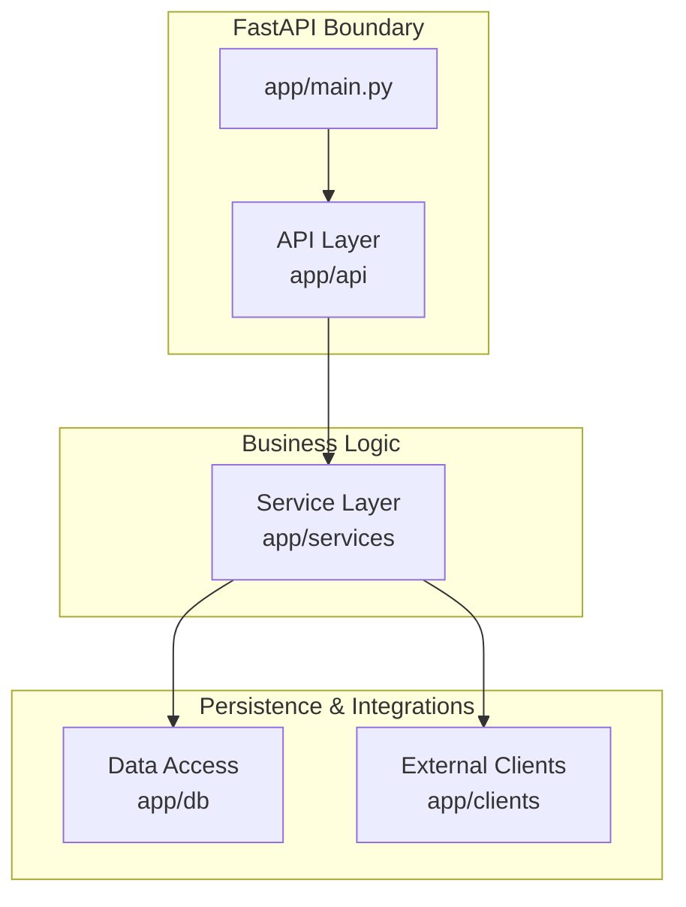
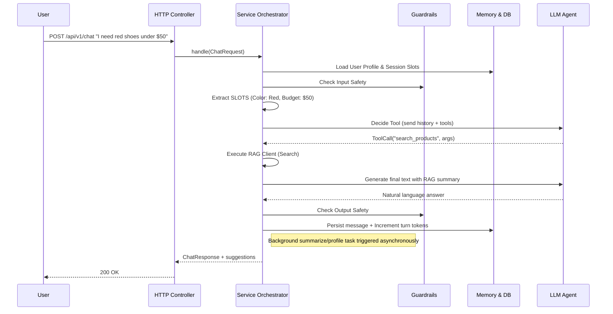

# Backend Architecture Overview

This document provides a comprehensive breakdown of the internal architecture for the **E-commerce Shopping Assistant Backend**. The application uses a robust, clean layered architecture built on top of **FastAPI**.

## Clean Architecture Layers

The backend strictly separates concerns. There is no business logic in controllers, and there are no direct database or external API calls in the services layer without using clients or repositories.

### 1. The Entrypoint (`app/main.py`)
Sets up the FastAPI application and lifespan tasks, including request ID tracing middleware (`structlog` context vars are used to trace latency and logs globally). Global exception handlers intercept domain exceptions and seamlessly convert them to HTTP responses.

### 2. The API Boundary (`app/api/`)
*   **Controllers** (`controllers/chat_controller.py`): Receives HTTP requests, initializes the single-request scope dependencies, and delegates entire workflows to `ChatService`. 
*   **DTOs** (`dto/`): Data Transfer Objects validate payload parameters using Pydantic.

### 3. The Orchestrator (`app/services/chat_service.py`)
This is the heart of the system. `ChatService` strings together a complex lifecycle for each incoming user message, following an **Agentic Pattern**:

1.  **Rate Limiting**: Throttles overly frequent requests.
2.  **Session & Memory**: Auto-resolves customer profiles and loads earlier chat history and entity slots (budget, size, color) via `MemoryService`.
3.  **Input Guardrails**: `GuardrailsService` ensures the user query is safe.
4.  **Intent & Slots Extraction**: Derives constraints from natural language (e.g. converting "under $50" to `max_price=50`).
5.  **LLM Tool Pick**: Prompted with the chat history and active tools (like `ToolRegistry` and `skills`), the LLM acts as an agent to pick the appropriate action (RAG lookups vs clarifying questions).
6.  **Tool Execution**: Executes the specific tools.
7.  **Final Prompt Building**: Combines history, retrieved contexts, slots, and profiles to prompt the LLM to write a final, natural response.
8.  **Output Guardrails & Citations**: Sanitizes the output and injects dynamic product citations/HTML blocks.
9.  **Persistence & Background**: Saves the payload securely while spawning async background tasks to update user profiles or generate summarizations.

### 4. External Integrations (`app/clients/`)
The app completely isolates third-party libraries:
*   **`LLMClient`**: Wraps OpenAI / Azure. It gracefully handles API rate limits, tool-calling structures, streaming tokens (`AsyncIterator`), and importantly, **automatically falls back** to cheaper models on failures.
*   **`RAGClient`**: Communicates over `httpx` to a standalone semantic-search microservice (`/api/v1/retrieve`) to bring back embedding-matched product documents. 

### 5. Datastore & Repositories (`app/db/`)
Follows the repository pattern. `repositories/` abstract standard CRUD queries over async SQLAlchemy. Keeps `Session`, `Customer`, and `Message` tables clean of raw external SQL syntax in upper levels.

---

## The Chat Request Lifecycle

Here is a visual step-by-step trace of how a single user message is serviced:

> [!TIP]
> The orchestrator delegates hard computation tasks to background workers (like DB profiling and text summarization) to return the chat response back to the customer instantly.

### Key Takeaways
- **Resilience**: Deep reliance on defensive coding strategies (e.g. fallback LLM models, non-fatal RAG pipeline failures where it degrades gracefully to "I couldn't find items...").
- **Stateless Agentics**: Everything needed for generation logic is injected contextually per request; nothing holds global state (aside from config singletons).
- **Tool Driven Evolution**: Extending capabilities simply involves adding components to the `ToolRegistry` and `skills` loaders rather than restructuring code. 
