# Vikrai — Full System Architecture

## The Commerce AI | 4-Service Agentic Shopping Platform

---

## System Overview

Vikrai is an agentic e-commerce platform where an AI assistant guides users from product discovery to checkout through natural conversation, photo-based outfit matching, and intelligent product comparison.

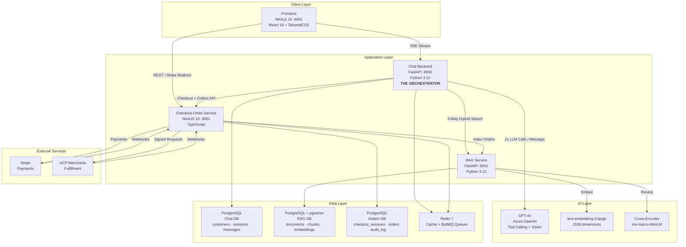

---

## How A Message Flows Through The System

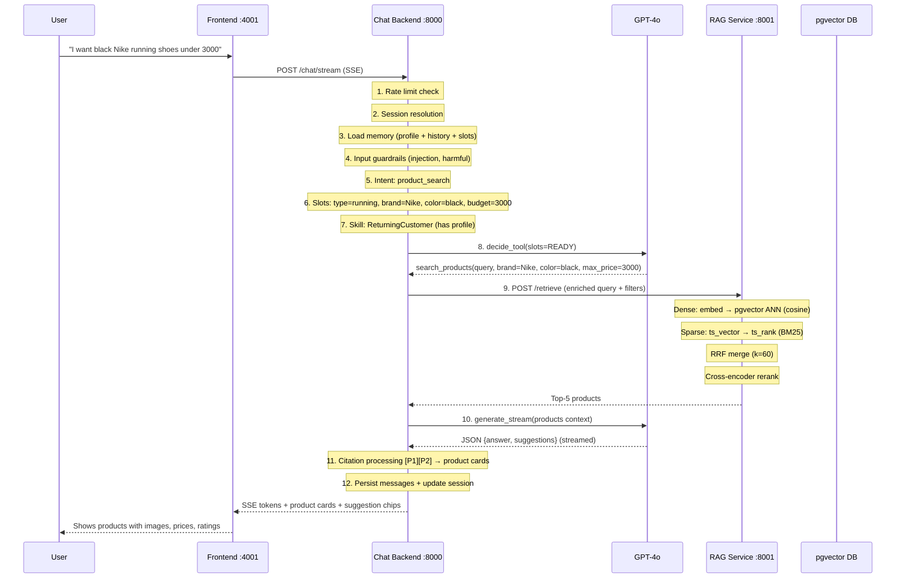

---

## The Four Services

### 1. Chat Backend (The Orchestrator)
**Port 8000 | FastAPI | Python 3.12**

The brain. Receives messages, runs a 12-step agentic pipeline, coordinates all other services.

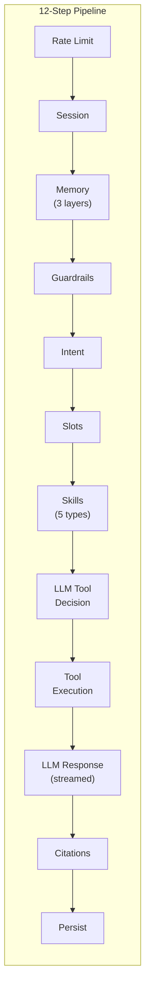

**Key capabilities:**
- 14 agent tools (search, compare, outfit matching, size advice, order lookup, etc.)
- 3-layer memory (turn history, session context, customer profile)
- 5 skills (stylist, gift advisor, size expert, empathy, returning customer)
- Photo upload with GPT-4o vision analysis
- Conversational slot gathering (max 2 questions before search)
- Input/output guardrails (injection, hallucination, off-topic)

---

### 2. RAG Service (Search & Embeddings)
**Port 8001 | FastAPI | Python 3.12**

3-way hybrid retrieval combining dense, sparse, and neural reranking.

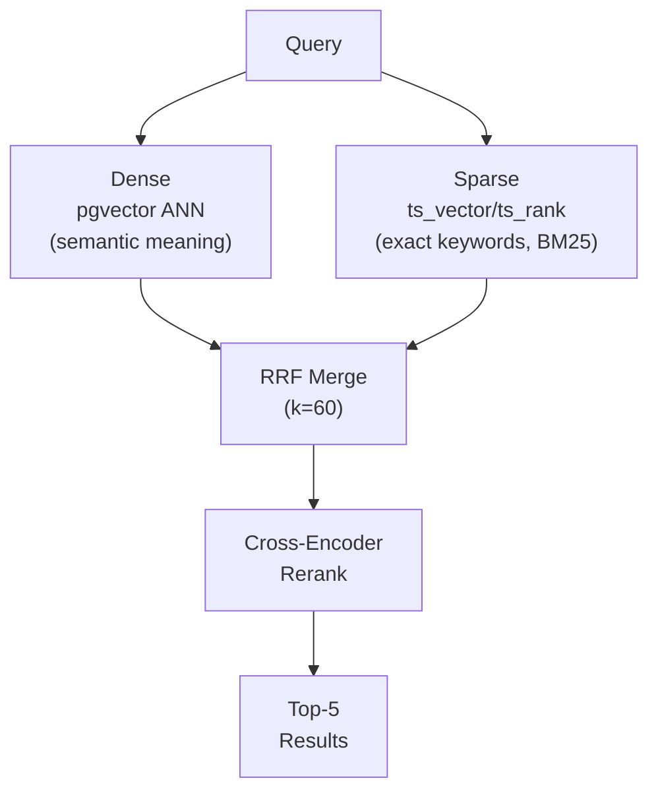

**Key capabilities:**
- Dense retrieval: OpenAI embeddings (1536d) + pgvector HNSW
- Sparse retrieval: PostgreSQL ts_vector + ts_rank (BM25-like)
- Reciprocal Rank Fusion for merging
- Cross-encoder reranking (ms-marco-MiniLM)
- Metadata filtering (brand, price, color, customer scope)
- Token-aware chunking with overlap
- SHA-256 deduplication

---

### 3. Checkout-Order Service (Commerce Engine)
**Port 3001 | NestJS 10 | TypeScript**

Full commerce lifecycle with Stripe payments and UCP merchant integration.

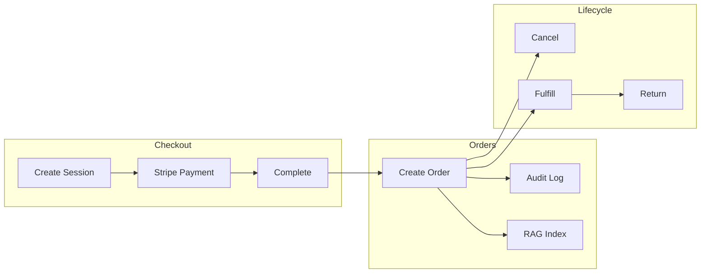

**Key capabilities:**
- Stripe PaymentIntent + Payment Links
- UCP merchant integration (signed requests, webhook verification)
- BullMQ async order processing
- Append-only audit trail (transactional with order mutations)
- Order indexing to RAG for search context
- Circuit breaker + retry + idempotency for merchant calls

---

### 4. Frontend (Chat Interface)
**Port 4001 | Next.js 14 | React 18**

Real-time chat UI with photo upload, product cards, and multi-step checkout.

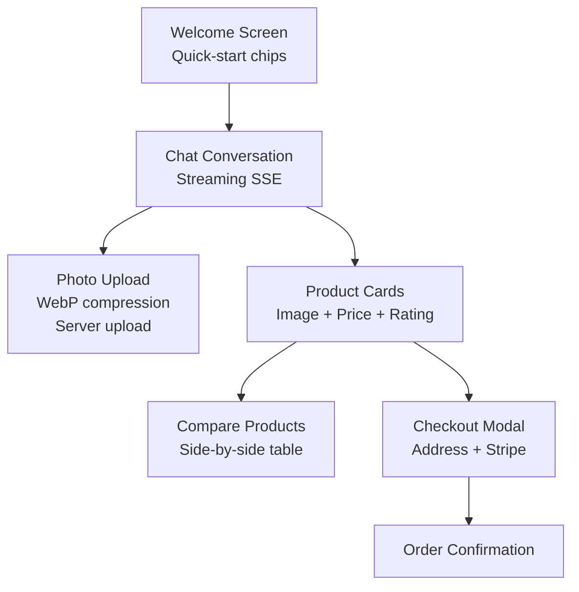

**Key capabilities:**
- Photo upload with WebP compression + server-side validation
- SSE streaming with real-time typing indicator
- Markdown rendering (bold, lists, tables)
- Product card carousel with multi-select compare
- Contextual suggestion chips
- Session management with titles
- Error boundary for crash recovery

---

## Memory Architecture

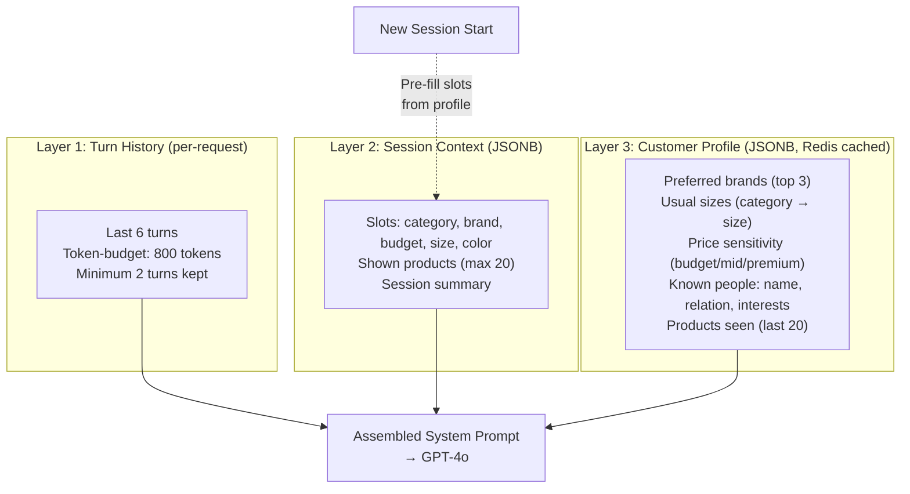

---

## Photo Upload Pipeline

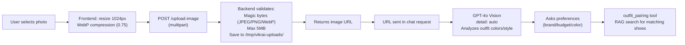

---

## Conversational Flow

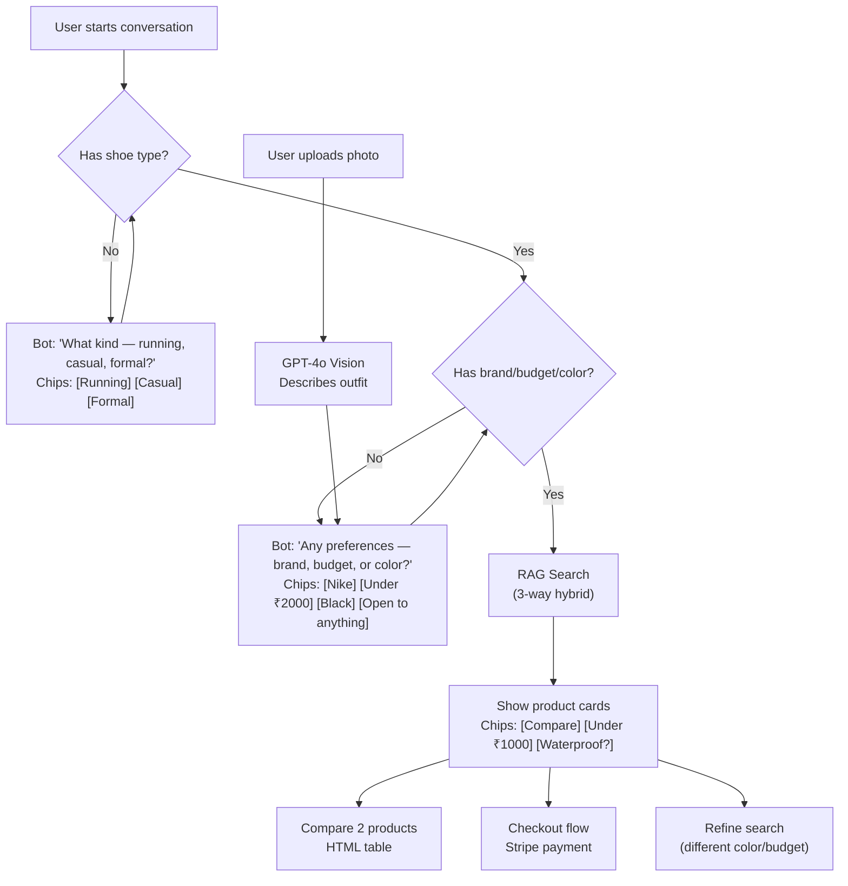

---

## Database Schemas

### Chat Backend

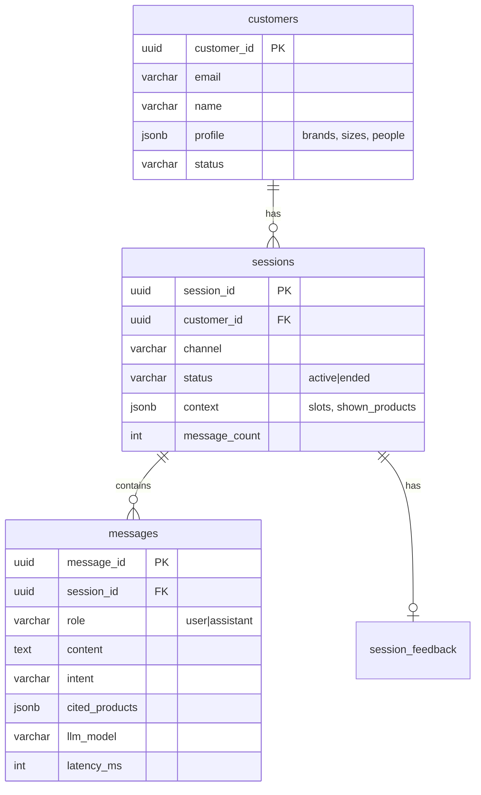

### RAG Service

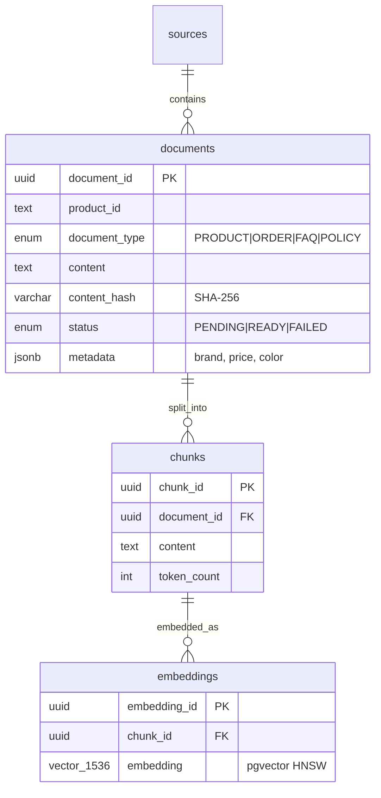

### Checkout-Order Service

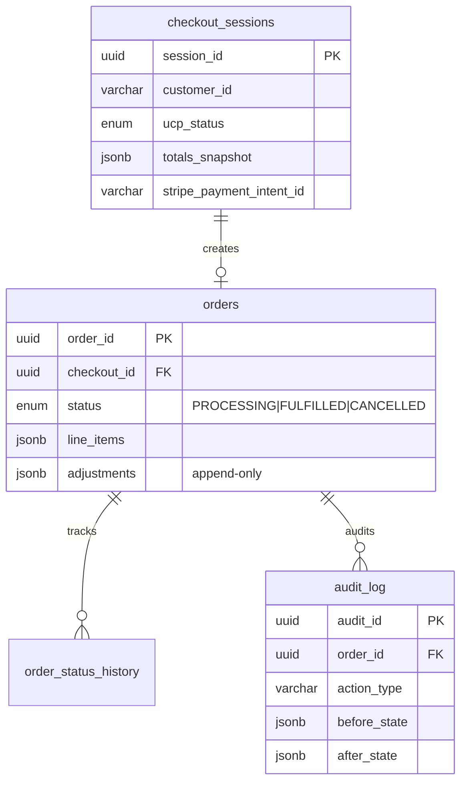

---

## API Surface

### Chat Backend (:8000) — 12 endpoints
| Method | Path | Purpose |
|--------|------|---------|
| POST | `/api/v1/chat/stream` | Send message (SSE) |
| POST | `/api/v1/chat` | Send message (sync) |
| POST | `/api/v1/chat/upload-image` | Upload image |
| GET | `/api/v1/chat/uploads/:file` | Serve image |
| POST | `/api/v1/chat/sessions` | Create session |
| POST | `/api/v1/chat/sessions/:id/end` | End session |
| GET | `/api/v1/chat/sessions/:id/messages` | Message history |
| POST | `/api/v1/chat/customers` | Create customer |
| GET | `/api/v1/chat/customers/:id` | Get customer |
| PATCH | `/api/v1/chat/customers/:id/profile` | Update profile |
| GET | `/api/v1/chat/customers/:id/sessions` | List sessions |

### RAG Service (:8001) — 7 endpoints
| Method | Path | Purpose |
|--------|------|---------|
| POST | `/api/v1/retrieve` | 3-way hybrid search |
| POST | `/api/v1/ingest/product` | Ingest product |
| POST | `/api/v1/ingest/products/bulk` | Bulk ingest |
| GET | `/api/v1/ingest/jobs/:id` | Job status |
| POST | `/api/v1/orders/index` | Index order |
| POST | `/api/v1/sources` | Create source |

### Checkout-Order (:3001) — 14 endpoints
| Method | Path | Purpose |
|--------|------|---------|
| POST | `/commerce/checkout/sessions` | Create checkout |
| POST | `/commerce/checkout/sessions/:id/payment-link` | Stripe link |
| POST | `/commerce/checkout/sessions/:id/complete` | Complete |
| GET | `/commerce/orders` | List orders |
| GET | `/commerce/orders/:id` | Order detail |
| POST | `/commerce/orders/:id/cancel` | Cancel |
| POST | `/commerce/orders/:id/return` | Return |
| POST | `/stripe/webhooks` | Stripe hooks |
| POST | `/commerce/webhooks/ucp/orders` | Merchant hooks |

---

## Security Layers

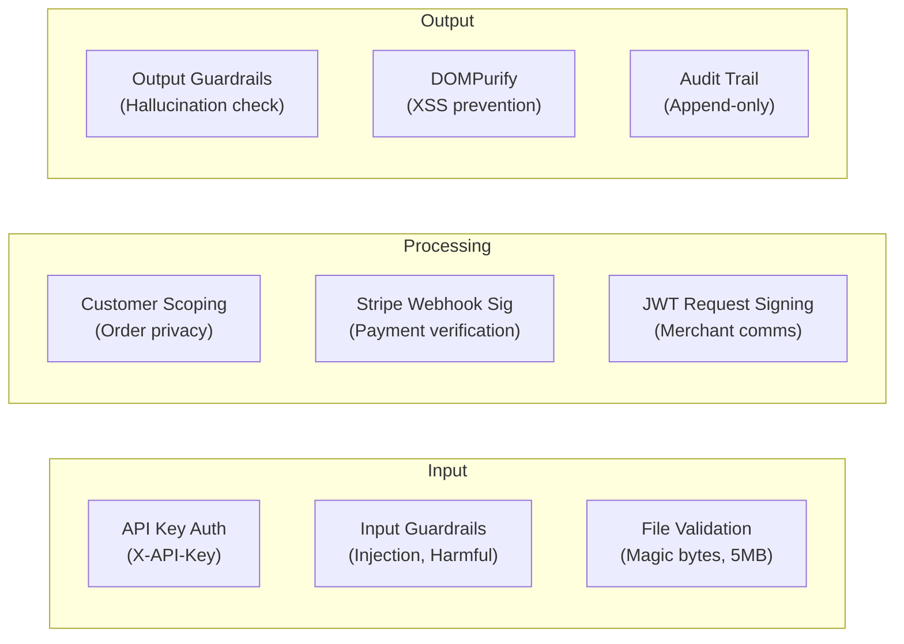

---

## Tech Stack Summary

| Layer | Technology |
|-------|-----------|
| Frontend | Next.js 14, React 18, TailwindCSS, TanStack Query, Framer Motion |
| Chat Backend | FastAPI, Python 3.12, SQLAlchemy async, Pydantic v2 |
| RAG Service | FastAPI, pgvector, OpenAI Embeddings, Cross-Encoder, ts_vector |
| Commerce | NestJS 10, TypeORM, Stripe SDK, BullMQ, jose (JWT) |
| LLM | GPT-4o (Azure OpenAI) — tool calling + vision |
| Embeddings | text-embedding-3-large (1536 dimensions) |
| Reranker | ms-marco-MiniLM-L-12-v2 (cross-encoder) |
| Database | PostgreSQL 15 + pgvector (HNSW) |
| Cache/Queue | Redis 7 (cache TTL + BullMQ) |
| Streaming | Server-Sent Events (SSE) |
| Payments | Stripe (PaymentIntent + Payment Links) |
| Merchants | UCP (Universal Commerce Protocol) |

---

## Key Design Decisions

| Decision | Why |
|----------|-----|
| 4 microservices | Chat (CPU-bound), RAG (memory-bound), Checkout (I/O-bound) scale independently |
| Agentic pattern | LLM picks tools — more flexible than hardcoded routing for ambiguous queries |
| 2-call LLM loop | Separates tool selection from response generation for better control |
| 3-way hybrid retrieval | Dense handles synonyms, sparse handles exact terms, reranker boosts precision |
| RRF over learned fusion | No training data needed, works out-of-box, provably effective |
| Conversational slots | 2 questions max — better UX than forms, worse than zero-shot but more accurate |
| Base64 → server upload | Reduces JSON payload from 1.3MB to 50 bytes, enables validation/moderation |
| BullMQ for orders | Decouples checkout from order creation — retry on failure, no lost orders |
| Append-only audit | Compliance-ready, transactional with mutations — can't accidentally lose history |
| Cross-session memory | "My friend who runs" persists across sessions — differentiating feature |
