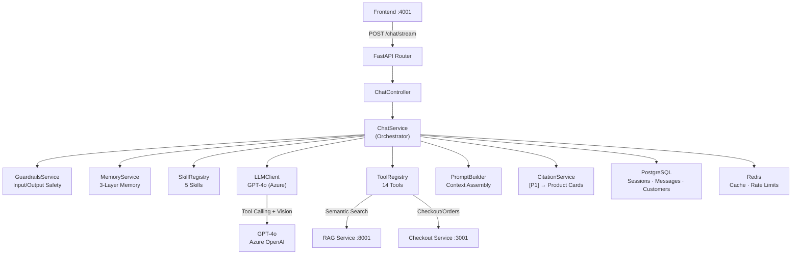
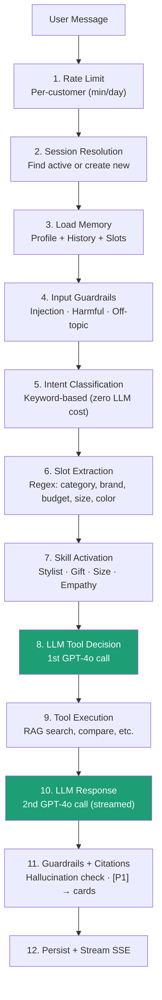
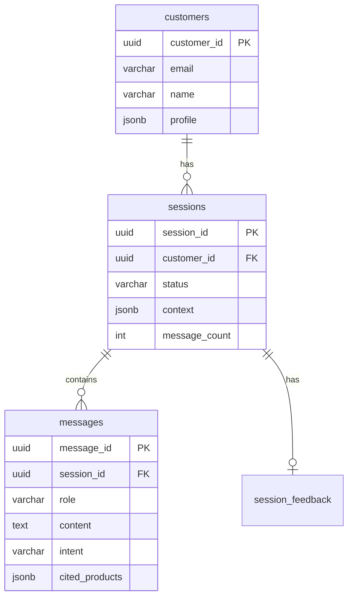

# Chat Backend — The Orchestrator

**Service:** FastAPI (Python 3.12) | **Port:** 8000 | **Role:** Agentic AI orchestrator

---

## What It Does

The chat backend is the brain of Vikrai. It receives user messages, decides what to do using GPT-4o, executes tools (search, compare, checkout), and streams natural language responses back to the user.

## Architecture



## Request Lifecycle (12 Steps)



## Service Reference

### ChatService — `app/services/chat_service.py`
The main orchestrator. Every message flows through here.

| Method | Description |
|--------|-------------|
| `handle(request)` | Sync endpoint — full 12-step pipeline, returns ChatResponse |
| `handle_stream(request)` | SSE streaming — yields tokens with heartbeats during slow ops |

**Key internals:**
- `_extract_slots(message)` — Regex-based extraction of category, brand, budget, size, color
- `_build_slot_status(slots)` — Tells LLM whether to search or ask more questions
- `_enrich_tool_args(tool, args, slots)` — Injects slot values into tool parameters

### LLMClient — `app/clients/llm_client.py`
GPT-4o wrapper with auto-fallback and vision support.

| Method | Description |
|--------|-------------|
| `decide_tool(prompt, message, history, tools, image?)` | 1st call — LLM picks which tool to invoke |
| `generate(prompt, message, history, tool_result, image?)` | 2nd call — generates natural response as JSON |
| `generate_stream(...)` | Streaming version — yields answer tokens, parses suggestions |
| `summarise(transcript)` | Compress conversation (uses cheap model) |

**Design decisions:**
- Auto-fallback: gpt-4o → gpt-4o-mini on rate limit
- Vision: multi-part content `[text, image_url]` with `detail: auto`
- Streaming state machine: PREAMBLE → ANSWER → DONE for JSON extraction

### ToolRegistry — `app/services/tool_registry.py`
14 tools the LLM can invoke:

| Tool | RAG? | Purpose |
|------|------|---------|
| `search_products` | Yes | Find products with color post-filtering + query enrichment |
| `outfit_pairing` | Yes | Match shoes to outfit/photo via StyleAdvisor |
| `gift_finder` | Yes | Gift recommendations |
| `compare_products` | Yes (2x) | Side-by-side comparison (ensures different products) |
| `size_advice` | Optional | Brand-specific sizing guidance |
| `stock_check` | Yes | Inventory availability |
| `order_lookup` | No | Order status template |
| `return_request` | Yes | Return policy retrieval |
| `policy_faq` | Yes | Policy document search |
| `order_history` | Yes | Customer-scoped order retrieval |
| `escalate_to_human` | No | Human handoff |
| `clarify_question` | No | Ask for more info |
| `direct_answer` | No | Answer directly |

### MemoryService — `app/services/memory_service.py`
3-layer memory system:

```
Layer 1: Turn History     — Last 6 turns, token-budget aware (800 tokens)
Layer 2: Session Context  — Slots, shown products, summary (JSONB)
Layer 3: Customer Profile — Brands, sizes, price sensitivity, known people (JSONB)
```

| Method | Description |
|--------|-------------|
| `load_slots(session)` | Extract shopping criteria from session context |
| `load_customer_profile(customer_id)` | Load profile (Redis cached, 5 min TTL) |
| `prefill_slots_from_profile(slots, profile)` | Pre-fill for returning customers |
| `extract_people_from_message(msg)` | Extract "my friend who runs" for cross-session memory |
| `persist_session_memory(...)` | Save slots + products to session |
| `update_customer_profile(...)` | Update brands, sizes, people context |

### GuardrailsService — `app/services/guardrails_service.py`
Stateless safety checks (zero LLM cost):

| Method | Checks |
|--------|--------|
| `check_input(msg)` | Prompt injection patterns, harmful keywords, off-topic (with shopping override) |
| `check_output(response, titles)` | Citation hallucination, off-brand language |
| `classify_intent(msg)` | Keyword → intent (product_search, comparison, order_status, etc.) |

### SkillRegistry — `app/services/skills/skill_registry.py`
5 skills, priority-evaluated, prompts merged:

| Skill | Trigger | Effect |
|-------|---------|--------|
| ReturningCustomer | Has profile | Skip known questions |
| Stylist | "outfit", "match" | Colour theory, fashion vocab |
| GiftAdvisor | "gift", "birthday" | Recipient-focused |
| SizeExpert | "size", "wide feet" | Brand sizing quirks |
| Empathy | "terrible", "manager" | Empathetic tone, escalation |

## Database Schema



## API Endpoints

| Method | Path | Description |
|--------|------|-------------|
| POST | `/api/v1/chat/stream` | Send message (SSE streaming) |
| POST | `/api/v1/chat` | Send message (sync) |
| POST | `/api/v1/chat/upload-image` | Upload image (multipart, returns URL) |
| GET | `/api/v1/chat/uploads/:filename` | Serve uploaded image |
| POST | `/api/v1/chat/sessions` | Create session |
| GET | `/api/v1/chat/sessions/:id` | Get session |
| POST | `/api/v1/chat/sessions/:id/end` | End session |
| GET | `/api/v1/chat/sessions/:id/messages` | Message history (cursor) |
| POST | `/api/v1/chat/customers` | Create customer |
| GET | `/api/v1/chat/customers/:id` | Get customer |
| PATCH | `/api/v1/chat/customers/:id/profile` | Update profile |
| GET | `/api/v1/chat/customers/:id/sessions` | List sessions |

## Tech Stack

| Component | Technology |
|-----------|-----------|
| Framework | FastAPI (Python 3.12) |
| ORM | SQLAlchemy 2.0 (async) |
| Validation | Pydantic v2 |
| LLM | GPT-4o via Azure OpenAI |
| Database | PostgreSQL 15 |
| Cache | Redis 7 |
| Streaming | Server-Sent Events (SSE) |
| Logging | structlog (JSON) |
