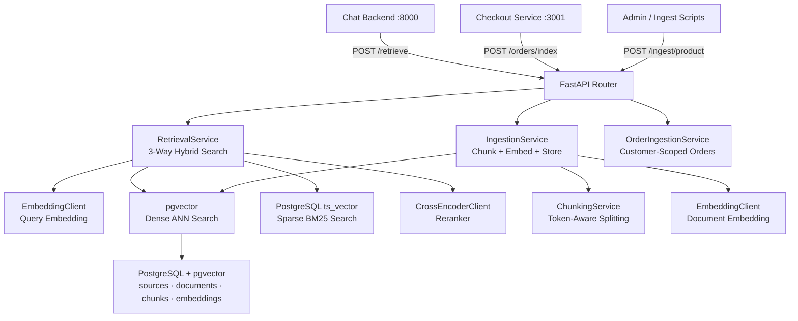
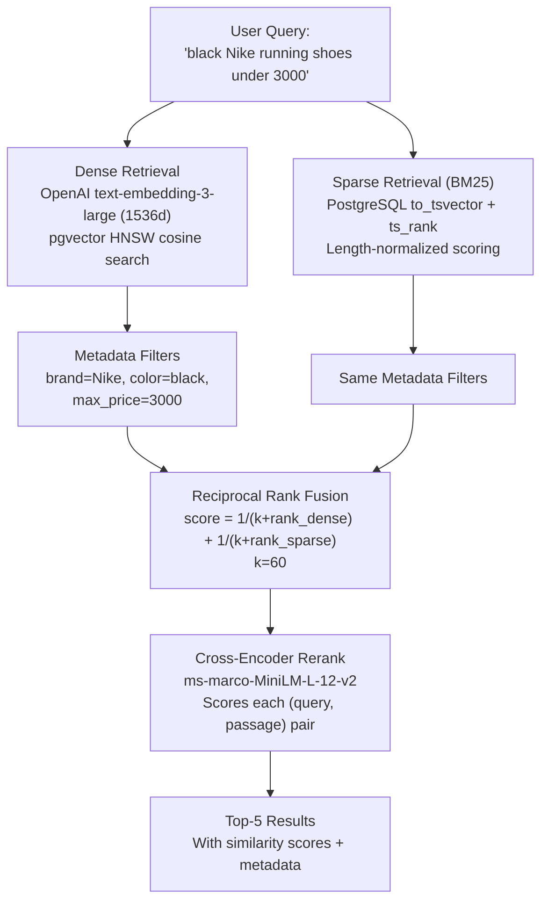
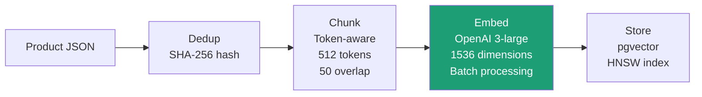
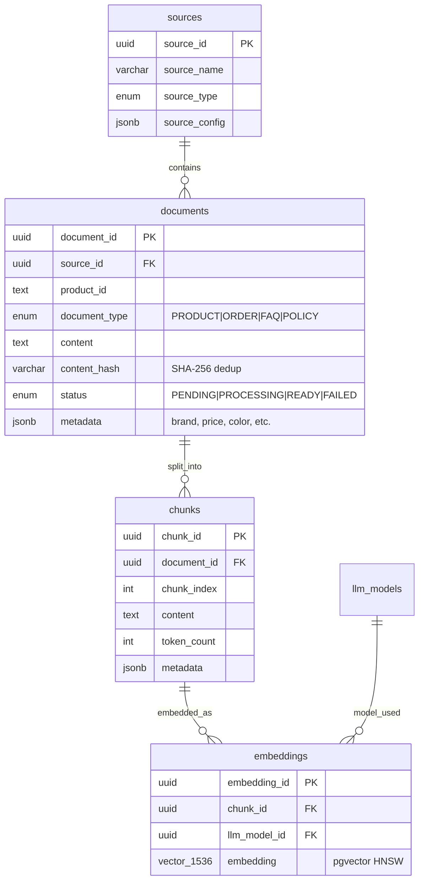

# RAG Service — Search & Embeddings

**Service:** FastAPI (Python 3.12) | **Port:** 8001 | **Role:** Vector search + document ingestion

---

## What It Does

The RAG service handles product ingestion (chunking, embedding, storage) and semantic retrieval. It uses a 3-way hybrid search: dense embeddings (pgvector), sparse keyword matching (PostgreSQL ts_vector/BM25), and cross-encoder reranking.

## Architecture

## 3-Way Hybrid Retrieval

### Why 3-Way?

| Retriever | Strength | Weakness |
|-----------|----------|----------|
| **Dense** (pgvector) | Understands meaning — "comfortable" finds "cushioned" | Misses exact brand names, model numbers |
| **Sparse** (BM25/ts_rank) | Exact match — "Nike Air Max 270" finds that exact product | Doesn't understand synonyms or intent |
| **Cross-Encoder** | Full attention over (query, passage) — highest accuracy | Too slow for full corpus, only used on top candidates |

**RRF merges dense + sparse**, then **cross-encoder re-scores** the merged list. Items appearing in BOTH dense and sparse get boosted scores.

## Ingestion Pipeline

### Chunking Strategy
1. Split on paragraph boundaries (double newlines)
2. Group paragraphs into token-bounded chunks (512 tokens)
3. Split oversized paragraphs at sentence boundaries
4. Apply sliding window as fallback
5. Prepend tail of previous chunk for overlap (50 tokens)
6. Filter chunks below minimum token count

## Service Reference

### RetrievalService — `app/services/retrieval_service.py`

| Method | Description |
|--------|-------------|
| `retrieve(query, top_k, rerank, filters, hybrid)` | Main entry — runs dense + sparse + RRF + rerank |
| `_vector_search(query, top_k, rerank, filters)` | Dense: embed query → pgvector ANN → metadata filter → optional rerank |
| `_keyword_search(keywords, top_k, filters)` | Sparse: ts_vector + ts_rank (BM25-like) with length normalization |
| `_rrf_merge(vector_results, keyword_results, top_k)` | Reciprocal Rank Fusion (k=60) |
| `_extract_keywords(query)` | Tokenize + stop word removal |
| `_ilike_fallback(keywords, top_k, filters)` | Fallback if ts_vector unavailable |

**Filters supported:** `brand`, `category`, `min_price`, `max_price`, `in_stock`, `color`, `customer_id`, `document_type`

### IngestionService — `app/services/ingestion_service.py`

| Method | Description |
|--------|-------------|
| `ingest(source_id, product_data)` | Validate, dedup, create document + job |
| `run_pipeline(document_id)` | Background: chunk → embed → store → mark READY |

### OrderIngestionService — `app/services/order_ingestion_service.py`

| Method | Description |
|--------|-------------|
| `index_order(source_id, customer_id, order)` | Index/re-index order as customer-scoped embedding |

### ChunkingService — `app/services/chunking_service.py`

| Method | Description |
|--------|-------------|
| `chunk(content, config)` | Token-aware splitting with overlap and offset tracking |

## Database Schema

## API Endpoints

| Method | Path | Description |
|--------|------|-------------|
| POST | `/api/v1/retrieve` | 3-way hybrid search |
| POST | `/api/v1/ingest/product` | Ingest single product |
| POST | `/api/v1/ingest/products/bulk` | Bulk ingest (1-500) |
| GET | `/api/v1/ingest/jobs/:id` | Job status/progress |
| POST | `/api/v1/orders/index` | Index order for search |
| POST | `/api/v1/sources` | Create knowledge source |
| GET | `/api/v1/sources` | List sources |
| GET | `/health` | Health check |

## Tech Stack

| Component | Technology |
|-----------|-----------|
| Embeddings | OpenAI text-embedding-3-large (1536d) |
| Vector DB | PostgreSQL + pgvector (HNSW index) |
| BM25 | PostgreSQL ts_vector + ts_rank |
| Reranker | sentence-transformers cross-encoder (ms-marco-MiniLM) |
| Framework | FastAPI (Python 3.12) |
| ORM | SQLAlchemy 2.0 (async) |
| Migrations | Alembic |

## Security

- **API Key:** `X-API-Key` header on all endpoints (except `/health`)
- **Customer Scoping:** ORDER documents require `customer_id` filter — prevents cross-customer data leakage
- **Deduplication:** SHA-256 content hash prevents redundant ingestion
