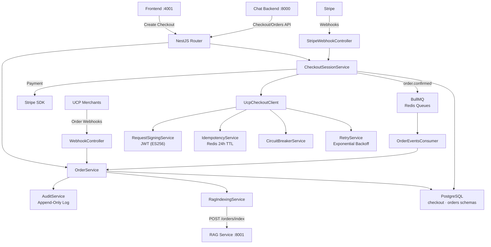
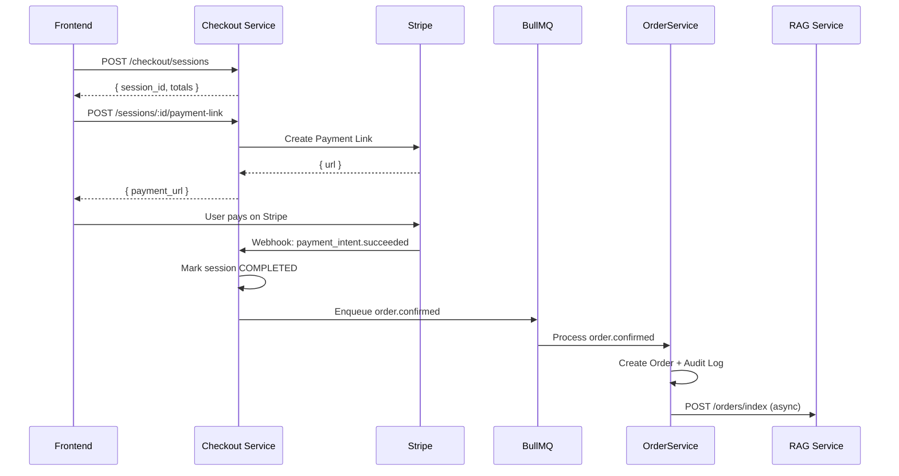
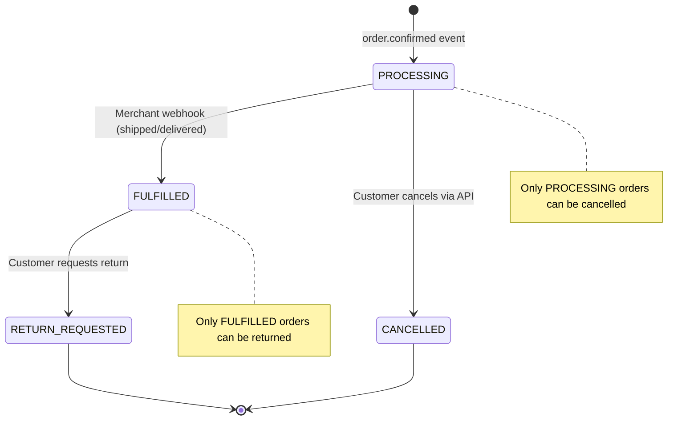
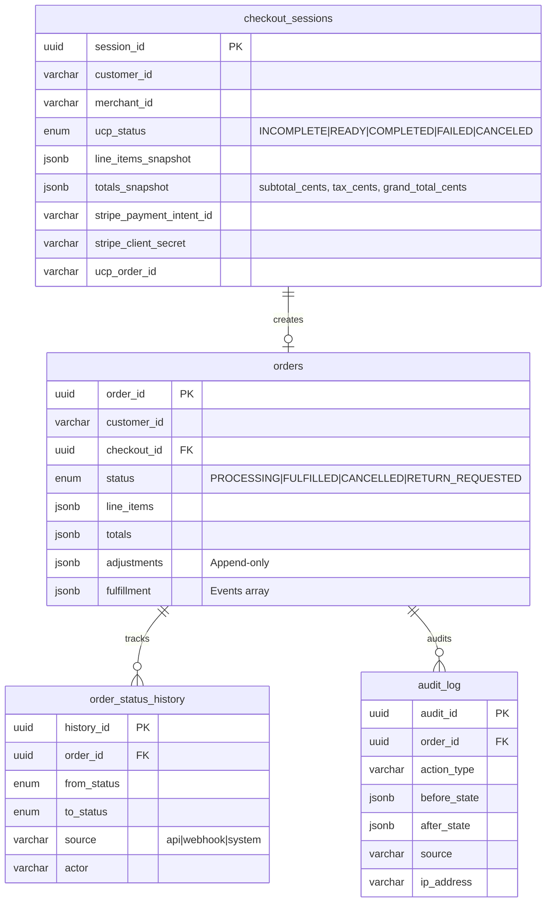

# Checkout-Order Service — Commerce Engine

**Service:** NestJS 10 (TypeScript) | **Port:** 3001 | **Role:** Payments, orders, merchant integration

---

## What It Does

Handles the full commerce lifecycle: checkout session management, Stripe payment processing, order creation, status tracking, cancellation/returns, merchant webhook handling via UCP (Universal Commerce Protocol), and order indexing into the RAG service.

## Architecture

## Checkout Flow

## Order State Machine

## Service Reference

### CheckoutSessionService

| Method | Description |
|--------|-------------|
| `createSession()` | Create local session, optionally sync with UCP merchant |
| `updateSession()` | Update line items, buyer info, context |
| `completeSession()` | Mark COMPLETED, enqueue order.confirmed event |
| `cancelSession()` | Mark CANCELED |
| `createOrGetPaymentIntent()` | Create Stripe PaymentIntent (cached per session) |
| `createPaymentLink()` | Create one-time Stripe Payment Link |
| `handlePaymentSucceeded()` | Stripe webhook → complete session |
| `handlePaymentFailed()` | Stripe webhook → mark PAYMENT_FAILED |

### OrderService

| Method | Description |
|--------|-------------|
| `createFromConfirmedEvent()` | Create order from checkout + audit log (transactional) |
| `cancelOrder()` | PROCESSING → CANCELLED + adjustment + audit (transactional) |
| `returnOrder()` | FULFILLED → RETURN_REQUESTED + adjustment + audit (transactional) |

### AuditService
Append-only audit log. Failure rolls back the entire order transaction.

| Action Types | Trigger |
|-------------|---------|
| `order_created` | Order creation |
| `status_changed` | Any status transition |
| `cancelled` | Customer cancellation |
| `return_initiated` | Return request |
| `adjustment_applied` | Refund/credit adjustment |

### UCP Client (Merchant Integration)

| Service | Purpose |
|---------|---------|
| `UcpCheckoutClient` | 5 REST operations (create/get/update/complete/cancel) |
| `MerchantProfileService` | Discover merchant via `/.well-known/ucp` (Redis cached 1h) |
| `RequestSigningService` | JWT signing (ES256/RS256) for outbound requests |
| `WebhookVerificationService` | Verify inbound merchant webhook signatures |
| `IdempotencyService` | Redis-backed dedup (24h TTL) |
| `CircuitBreakerService` | Per-endpoint circuit breaker (Redis) |
| `RetryService` | Exponential backoff with jitter (3 attempts) |

## Database Schema

## API Endpoints

| Method | Path | Description |
|--------|------|-------------|
| POST | `/commerce/checkout/sessions` | Create checkout session |
| GET | `/commerce/checkout/sessions/:id` | Get session |
| PUT | `/commerce/checkout/sessions/:id` | Update session |
| POST | `/commerce/checkout/sessions/:id/complete` | Complete checkout |
| POST | `/commerce/checkout/sessions/:id/cancel` | Cancel session |
| POST | `/commerce/checkout/sessions/:id/payment-intent` | Create Stripe PaymentIntent |
| POST | `/commerce/checkout/sessions/:id/payment-link` | Create Stripe Payment Link |
| GET | `/commerce/checkout/sessions/:id/summary` | Get totals |
| GET | `/commerce/orders` | List orders (cursor-paginated) |
| GET | `/commerce/orders/:id` | Order detail + history |
| POST | `/commerce/orders/:id/cancel` | Cancel order |
| POST | `/commerce/orders/:id/return` | Request return |
| POST | `/stripe/webhooks` | Stripe webhook handler |
| POST | `/commerce/webhooks/ucp/orders` | Merchant webhook handler |
| GET | `/.well-known/ucp` | Platform profile discovery |

## Message Queues (BullMQ)

| Queue | Job | Producer | Consumer |
|-------|-----|----------|----------|
| `order-events` | `order.confirmed` | CheckoutSessionService | OrderEventsConsumer |
| `webhook-ingestion` | `ucp.order.event` | WebhookController | WebhookIngestionConsumer |

## Tech Stack

| Component | Technology |
|-----------|-----------|
| Framework | NestJS 10 (TypeScript) |
| ORM | TypeORM |
| Payments | Stripe SDK v21 |
| Queues | BullMQ (Redis) |
| Signing | jose (JWT ES256/RS256) |
| Database | PostgreSQL (checkout + orders schemas) |
| Cache | Redis 7 |

## Security

| Mechanism | Purpose |
|-----------|---------|
| Stripe webhook signature | Verify payment events are from Stripe |
| JWT request signing | Sign outbound merchant requests (ES256) |
| Webhook verification | Verify inbound merchant webhooks |
| Idempotency keys | Prevent duplicate order creation (Redis 24h) |
| Circuit breaker | Prevent cascading merchant failures |
| Audit trail | Append-only, transactional with order mutations |
