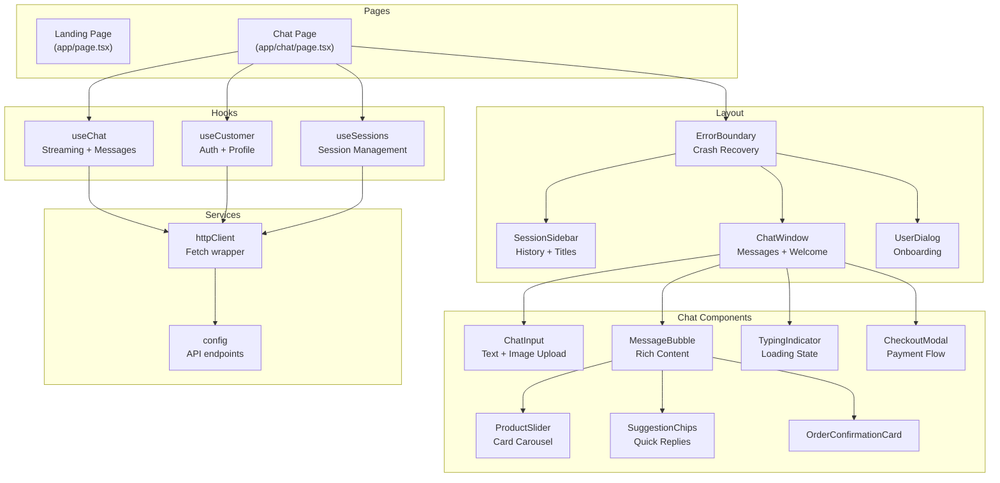
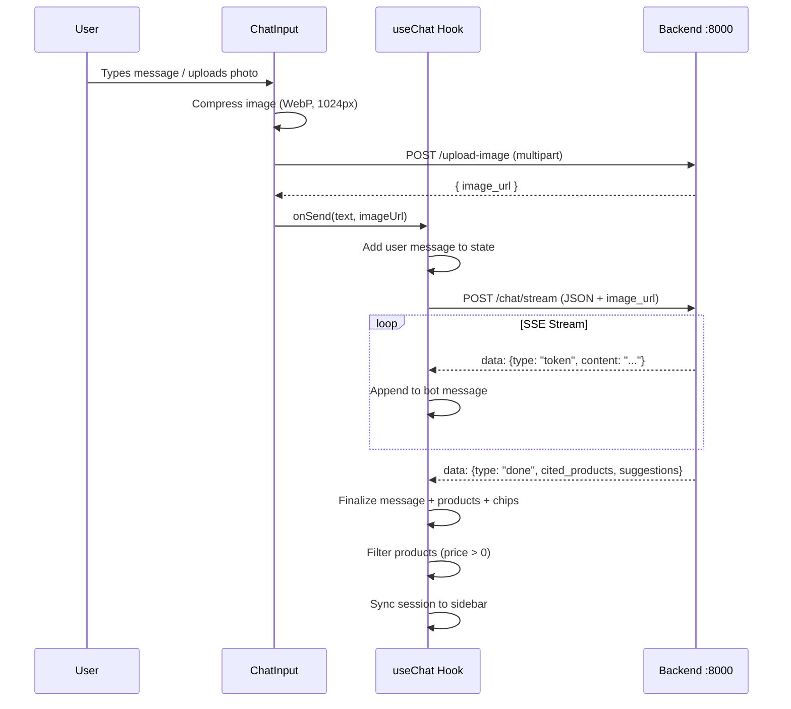

# Frontend — Chat Interface

**Service:** Next.js 14 (React 18) | **Port:** 4001 | **Role:** User-facing chat UI

---

## What It Does

A real-time chat interface where users discover products through conversation, upload outfit photos for shoe matching, compare products, and complete purchases — all in one conversation.

## Architecture



## Data Flow



## Component Reference

### ChatInput — `components/ChatInput.tsx`
```typescript
Props: { onSend: (msg, imageUrl?) => void, disabled?, sessionEnded? }
```
| Feature | Implementation |
|---------|---------------|
| Image upload | Camera icon → file picker → compress (WebP 0.75) → upload to backend → show URL preview |
| Upload state | Spinner during upload, disabled send button |
| Validation | Image types only (jpeg/png/webp), server validates magic bytes + 5MB limit |
| Auto-message | If image but no text → "Here's my outfit, help me find matching shoes" |
| Commands | `/start` (new session), `/end` (end session with confirmation) |

### MessageBubble — `components/MessageBubble.tsx`
```typescript
Props: { message, onSelectProduct?, onSelectSuggestion?, onCompareProducts?, onCheckout? }
```
| Content | Rendering |
|---------|-----------|
| User text | Green gradient bubble, right-aligned |
| Bot text | Dark bubble, left-aligned, markdown rendered via `marked` |
| User image | `` above text in user bubble |
| Products | ProductSlider carousel (if citedProducts present) |
| Suggestions | SuggestionChips (if suggestions present) |
| Checkout | "Proceed to Checkout" button → opens CheckoutModal |
| Order | OrderConfirmationCard with line items + totals |
| Streaming | Blinking cursor until streamDone |

### ProductSlider — `components/ProductSlider.tsx`
```typescript
Props: { products: ProductCardDTO[], onSelectProduct, onCompareProducts? }
```
- Horizontal scrollable carousel (180px cards)
- Multi-select with checkmark badges
- 1 selected → "Send" button, 2+ selected → "Compare" button
- Shows: image, name (2-line clamp), price (₹), star rating

### SessionSidebar — `components/SessionSidebar.tsx`
```typescript
Props: { sessions, activeSessionId, isLoading, onSelectSession, onNewSession }
```
- Session list with date, status (Active/Ended), message count
- Auto-generated session titles from first user message
- Active session highlighted with teal border
- "New Session" button

### CheckoutModal — `components/CheckoutModal.tsx`
Multi-step flow:
1. **Select address** — saved addresses or new form
2. **Address form** — name, address, city, state, pincode, phone
3. **Redirecting** — creates Stripe Payment Link, redirects user
4. **Awaiting** — polls session status every 3 seconds
5. **Success/Failed** — shows result, saves address to profile

## Hooks Reference

### useChat — `hooks/useChat.ts`
Core chat logic and SSE streaming.

| Method | Description |
|--------|-------------|
| `sendMessage(text, imageUrl?)` | Send message with optional image URL |
| `sendProductMessage(id, name)` | "Tell me more about {product}" |
| `sendCompareMessage(products)` | "Compare {A} and {B}" |
| `addOrderConfirmation(order)` | Inject order confirmation card |

**Key behaviors:**
- SSE stream parsing with buffer handling
- `filterValidProducts()` — removes products with price 0 or null
- `syncSession()` — updates URL, invalidates session cache, cross-tab sync via localStorage
- Session ended detection from cached query data

### useCustomer — `hooks/useCustomer.ts`
Customer auth and profile management.

| Method | Description |
|--------|-------------|
| `createCustomer(name, email)` | Create via API, persist to localStorage |
| `updateProfile(profile)` | Merge profile data (addresses, preferences) |

### useSessions — `hooks/useSessions.ts`
Session management with React Query.

| Method | Description |
|--------|-------------|
| `selectSession(id)` | Set active + update URL |
| `createSession(customerId)` | Create + set active + update URL immediately |

**Cross-tab sync:** Listens for `localStorage("session_updated")` events. Polls URL for same-tab sync (500ms).

## Key Features

| Feature | Details |
|---------|---------|
| **Welcome Screen** | Vikrai branding, description, quick-start chips (Casual, Running, Formal) |
| **Photo Upload** | WebP compression, server upload with spinner, magic byte validation |
| **Markdown Rendering** | `marked` library for bot messages (bold, lists, tables, headers) |
| **Error Boundary** | Class component wrapping chat page, shows reload button on crash |
| **Hydration Fix** | `suppressHydrationWarning` on body + message containers |
| **Price Filtering** | Products with price 0 or null removed before display |
| **Streaming** | Real-time token display with "Finding the best options..." indicator |

## Tech Stack

| Component | Technology |
|-----------|-----------|
| Framework | Next.js 14 (App Router) |
| UI | React 18, TailwindCSS |
| State | TanStack React Query v5 |
| Animation | Framer Motion |
| Markdown | marked |
| Sanitization | DOMPurify |
| HTTP | Native fetch |
| Fonts | Inter, Josefin Sans, Space Mono |
