# Vikrai - The Commerce AI

## Agentic Shopping Assistant - Technical Documentation

---

## 1. System Architecture

### 1.1 High-Level Overview

Vikrai is a 4-service agentic e-commerce platform where an AI assistant guides users from product discovery to checkout through natural conversation.

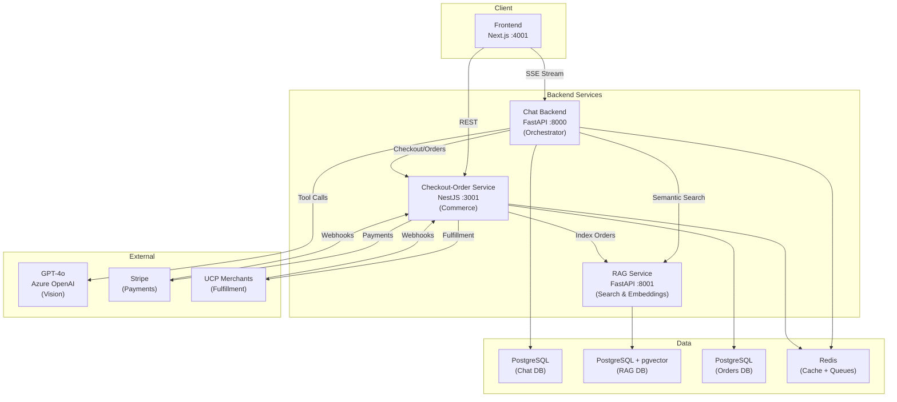

### 1.2 Tech Stack

| Service | Technology | Port |
|---------|-----------|------|
| Frontend | Next.js 14, React 18, TailwindCSS, TanStack Query | 4001 |
| Chat Backend | FastAPI, Python 3.12, SQLAlchemy async, Pydantic v2 | 8000 |
| RAG Service | FastAPI, pgvector, OpenAI Embeddings, Cross-Encoder | 8001 |
| Checkout-Order | NestJS 10, TypeORM, Stripe SDK, BullMQ, jose | 3001 |
| Database | PostgreSQL 15 + pgvector extension | 5432 |
| Cache/Queue | Redis 7 | 6379 |
| LLM | GPT-4o (Azure OpenAI) with Vision | - |
| Payments | Stripe (PaymentIntent + Payment Links) | - |

---

## 2. Chat Backend (Orchestrator)

### 2.1 Request Lifecycle

Every user message goes through a 12-step agentic pipeline:

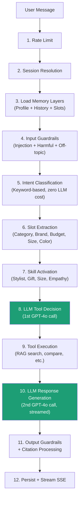

### 2.2 Services

| Service | File | Purpose |
|---------|------|---------|
| **ChatService** | `chat_service.py` | Main orchestrator — coordinates all services for one message |
| **ToolRegistry** | `tool_registry.py` | 14 agent tools — dispatches LLM tool calls to handlers |
| **LLMClient** | `llm_client.py` | GPT-4o wrapper — tool calling, streaming, vision, auto-fallback |
| **RAGClient** | `rag_client.py` | Semantic search client — Redis-cached, graceful degradation |
| **MemoryService** | `memory_service.py` | 3-layer memory — session slots, customer profile, people context |
| **GuardrailsService** | `guardrails_service.py` | Input/output safety — injection, hallucination, off-topic |
| **PromptBuilderService** | `prompt_builder_service.py` | Assembles system prompt from all context layers |
| **CitationService** | `citation_service.py` | Converts [P1][P2] markers to product cards + HTML |
| **SkillRegistry** | `skill_registry.py` | 5 skills — context-based prompt customization |
| **StyleAdvisorService** | `style_advisor_service.py` | Color pairing + size guidance (pure logic) |

### 2.3 Agentic Tool System

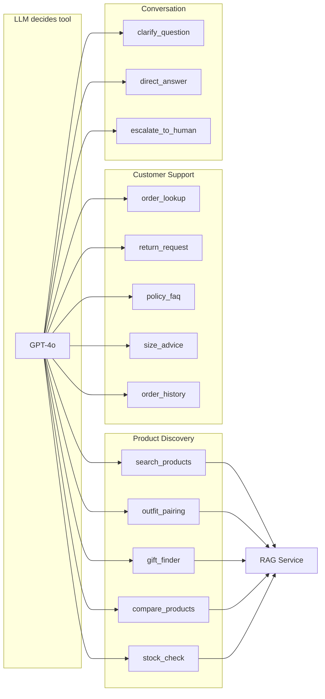

### 2.4 Memory Architecture

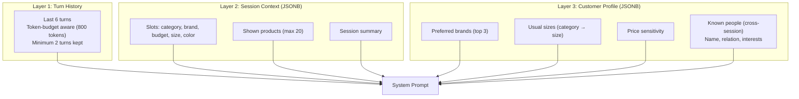

### 2.5 Skill System

| Skill | Trigger | Effect |
|-------|---------|--------|
| ReturningCustomer | Has profile data | Skip known questions, personalize |
| Stylist | "outfit", "match", "style" | Fashion vocabulary, colour theory |
| GiftAdvisor | "gift", "birthday", "for my dad" | Recipient-focused recommendations |
| SizeExpert | "size", "fit", "wide feet" | Brand-specific sizing quirks |
| Empathy | "terrible", "broken", "manager" | Empathetic tone, proactive escalation |

### 2.6 API Endpoints

| Method | Path | Description |
|--------|------|-------------|
| POST | `/api/v1/chat/stream` | Send message (SSE streaming) |
| POST | `/api/v1/chat` | Send message (sync) |
| POST | `/api/v1/chat/sessions` | Create session |
| GET | `/api/v1/chat/sessions/:id` | Get session |
| POST | `/api/v1/chat/sessions/:id/end` | End session |
| GET | `/api/v1/chat/sessions/:id/messages` | Message history |
| POST | `/api/v1/chat/customers` | Create customer |
| GET | `/api/v1/chat/customers/:id` | Get customer |
| PATCH | `/api/v1/chat/customers/:id/profile` | Update profile |
| GET | `/api/v1/chat/customers/:id/sessions` | List sessions |

---

## 3. RAG Service (Search & Embeddings)

### 3.1 Ingestion Pipeline

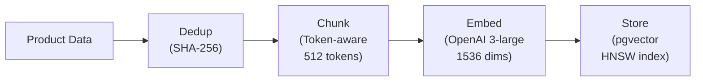

### 3.2 Retrieval Pipeline (3-Way Hybrid)

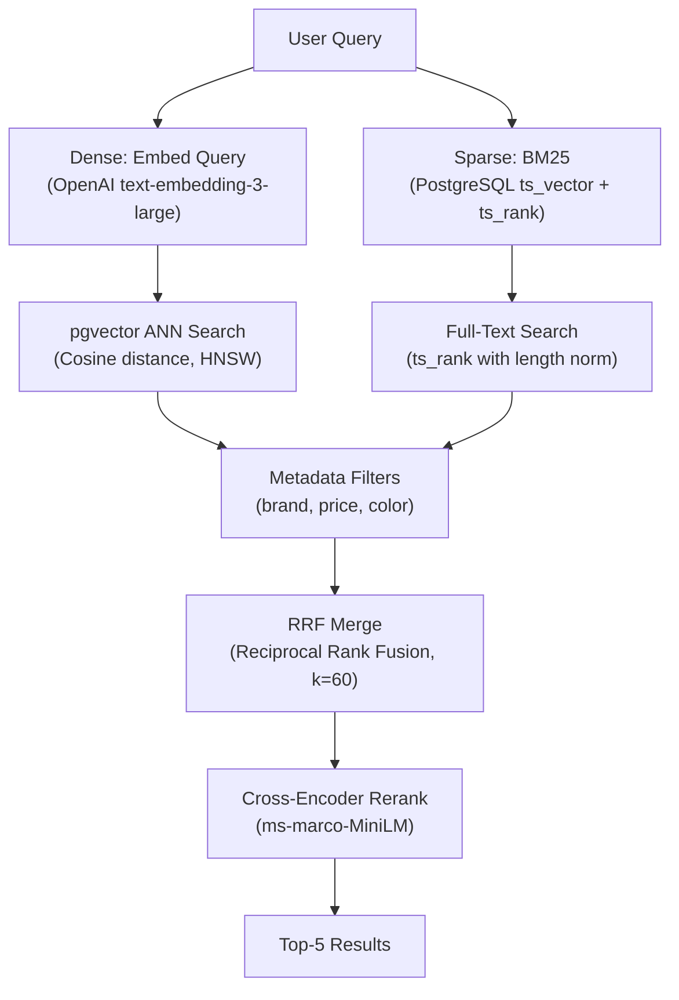

**3-way hybrid approach:**
1. **Dense retrieval** — OpenAI embeddings (1536d) with pgvector HNSW cosine search
2. **Sparse retrieval (BM25)** — PostgreSQL `ts_vector` + `ts_rank` with document length normalization
3. **Reranking** — Cross-encoder (ms-marco-MiniLM) scores each (query, passage) pair

Results from dense and sparse are merged using **Reciprocal Rank Fusion (RRF)** before reranking. Falls back to ILIKE if `ts_vector` is unavailable.

### 3.3 Services

| Service | Purpose |
|---------|---------|
| **IngestionService** | Document dedup, chunking, embedding, storage pipeline |
| **RetrievalService** | Query embedding, vector search, filtering, reranking |
| **ChunkingService** | Token-aware text splitting with overlap |
| **OrderIngestionService** | Customer-scoped order indexing for search |

### 3.4 API Endpoints

| Method | Path | Description |
|--------|------|-------------|
| POST | `/api/v1/retrieve` | Semantic search with filters |
| POST | `/api/v1/ingest/product` | Ingest single product |
| POST | `/api/v1/ingest/products/bulk` | Bulk ingest (1-500) |
| GET | `/api/v1/ingest/jobs/:id` | Job status |
| POST | `/api/v1/orders/index` | Index order for search |
| POST | `/api/v1/sources` | Create knowledge source |

### 3.5 Database Schema

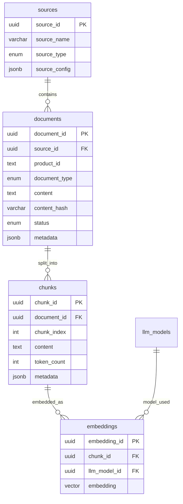

---

## 4. Checkout-Order Service (Commerce)

### 4.1 Checkout Flow

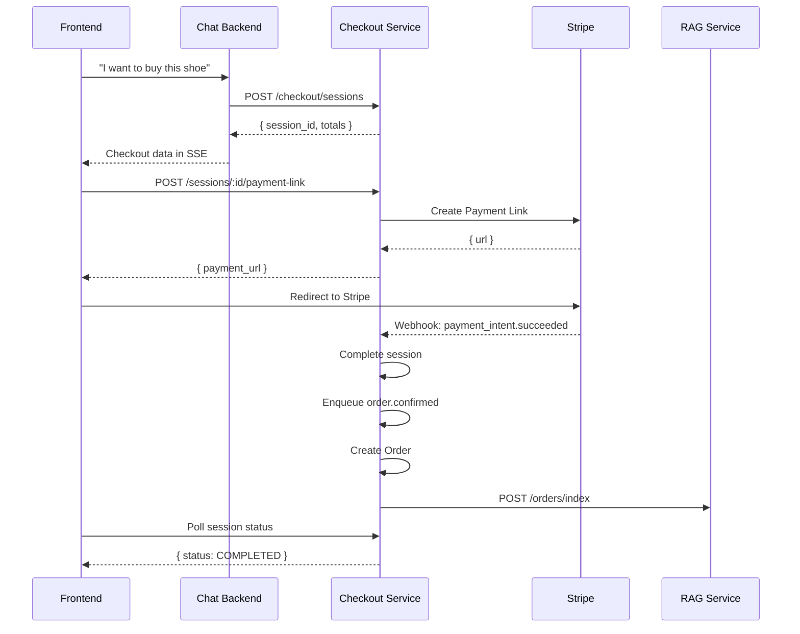

### 4.2 Services

| Service | Purpose |
|---------|---------|
| **CheckoutSessionService** | Create/update/complete checkout sessions, Stripe integration |
| **OrderService** | Order lifecycle — create, cancel, return with audit trail |
| **RagIndexingService** | Fire-and-forget order indexing to RAG service |
| **AuditService** | Append-only audit log for all order mutations |
| **MerchantProfileService** | UCP merchant discovery and caching |
| **RequestSigningService** | JWT signing for outbound merchant requests |
| **IdempotencyService** | Redis-backed request deduplication |
| **CircuitBreakerService** | Per-endpoint circuit breaker for merchant calls |

### 4.3 API Endpoints

| Method | Path | Description |
|--------|------|-------------|
| POST | `/commerce/checkout/sessions` | Create checkout session |
| GET | `/commerce/checkout/sessions/:id` | Get session |
| POST | `/commerce/checkout/sessions/:id/payment-link` | Create Stripe Payment Link |
| POST | `/commerce/checkout/sessions/:id/complete` | Complete checkout |
| GET | `/commerce/orders` | List orders (cursor-paginated) |
| GET | `/commerce/orders/:id` | Get order detail + history |
| POST | `/commerce/orders/:id/cancel` | Cancel order |
| POST | `/commerce/orders/:id/return` | Request return |
| POST | `/stripe/webhooks` | Stripe webhook handler |
| POST | `/commerce/webhooks/ucp/orders` | Merchant webhook handler |

### 4.4 Order State Machine

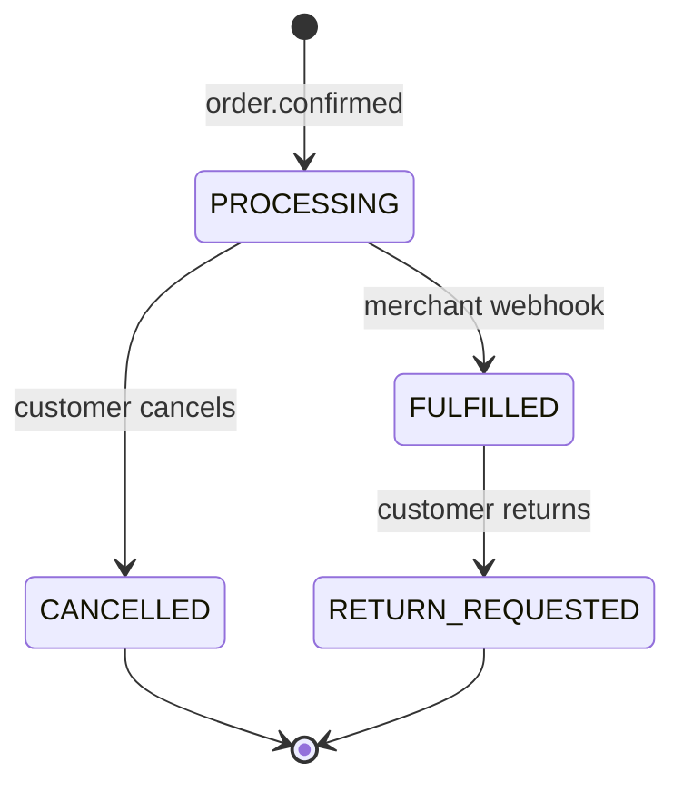

---

## 5. Frontend

### 5.1 Component Architecture

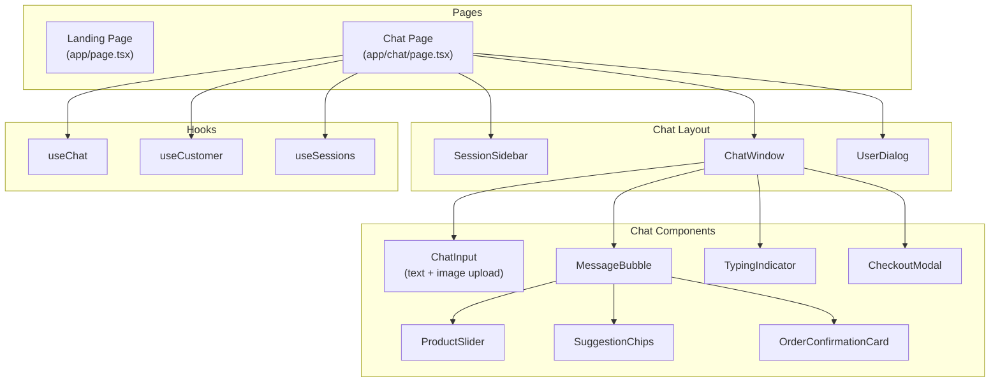

### 5.2 Key Features

| Feature | Description |
|---------|-------------|
| **Photo Upload** | Camera icon, resize to 800px, GPT-4o vision analysis for outfit matching |
| **Streaming Chat** | Real-time SSE token streaming with typing indicator |
| **Product Cards** | Horizontal carousel with images, prices, ratings, multi-select compare |
| **Suggestion Chips** | Contextual quick-replies (brands, budgets, colors) |
| **Session Management** | Sidebar with session history, titles, status tracking |
| **Welcome Screen** | Onboarding with quick-start chips |
| **Checkout Flow** | Address selection, Stripe payment, order confirmation |
| **Markdown Rendering** | Bot messages rendered with markdown (bold, lists, tables) |
| **Price Filtering** | Products with zero/missing prices hidden |
| **Color Filtering** | Post-filter RAG results by requested color |

---

## 6. End-to-End User Journey

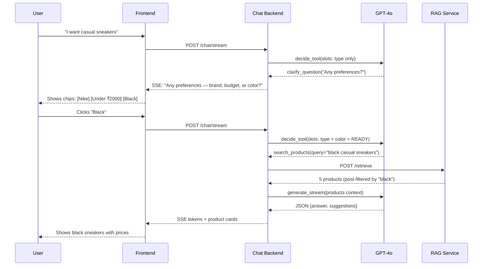

---

## 7. Database Schemas

### 7.1 Chat Backend Database

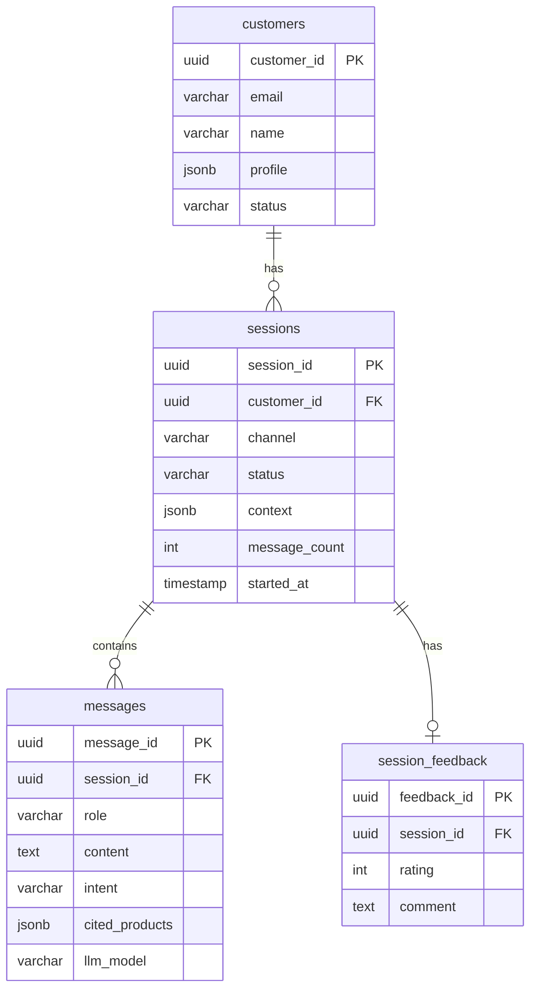

### 7.2 Checkout-Order Database

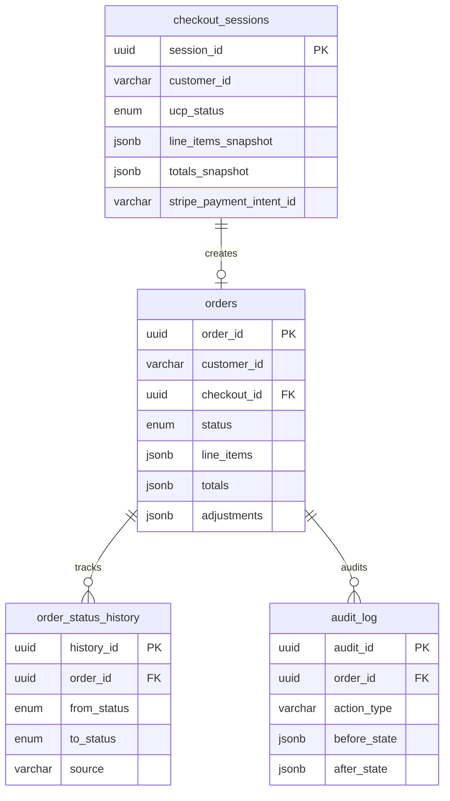

---

## 8. Security

| Layer | Mechanism |
|-------|-----------|
| API Authentication | X-API-Key header on all endpoints |
| Input Safety | Prompt injection detection, harmful content blocking |
| Output Safety | Citation hallucination check, off-brand language detection |
| Data Privacy | Customer-scoped order retrieval (Requirement 12.2, 12.4) |
| Payment Security | Stripe webhook signature verification |
| Merchant Comms | JWT-signed requests (ES256/RS256), webhook verification |
| XSS Prevention | DOMPurify HTML sanitization on frontend |
| Idempotency | Redis-backed request deduplication (24h TTL) |
| Circuit Breaking | Per-endpoint circuit breaker for merchant calls |

---

## 9. Key Design Decisions

| Decision | Rationale |
|----------|-----------|
| **Agentic pattern** (LLM picks tools) | More flexible than hardcoded routing; handles ambiguous queries |
| **2-call LLM loop** (decide + generate) | Separates tool selection from response writing for better control |
| **Conversational slot gathering** | Better product discovery than immediate search with no context |
| **Base64 image transport** | Simplest — no CDN/upload infrastructure needed |
| **SSE streaming** | Real-time typing effect; better UX than waiting for full response |
| **pgvector + HNSW** | Fast ANN search with metadata filtering in single query |
| **Cross-encoder reranking** | Improves relevance over pure vector similarity |
| **BullMQ for order events** | Decouples checkout completion from order creation; retry on failure |
| **Append-only audit log** | Compliance-ready order history; transactional with order mutations |
| **Redis caching** | 5-min TTL for RAG results and customer profiles; reduces latency |
